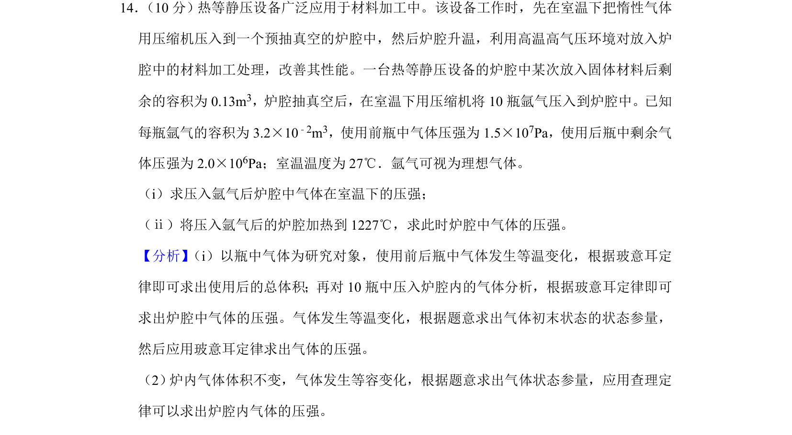
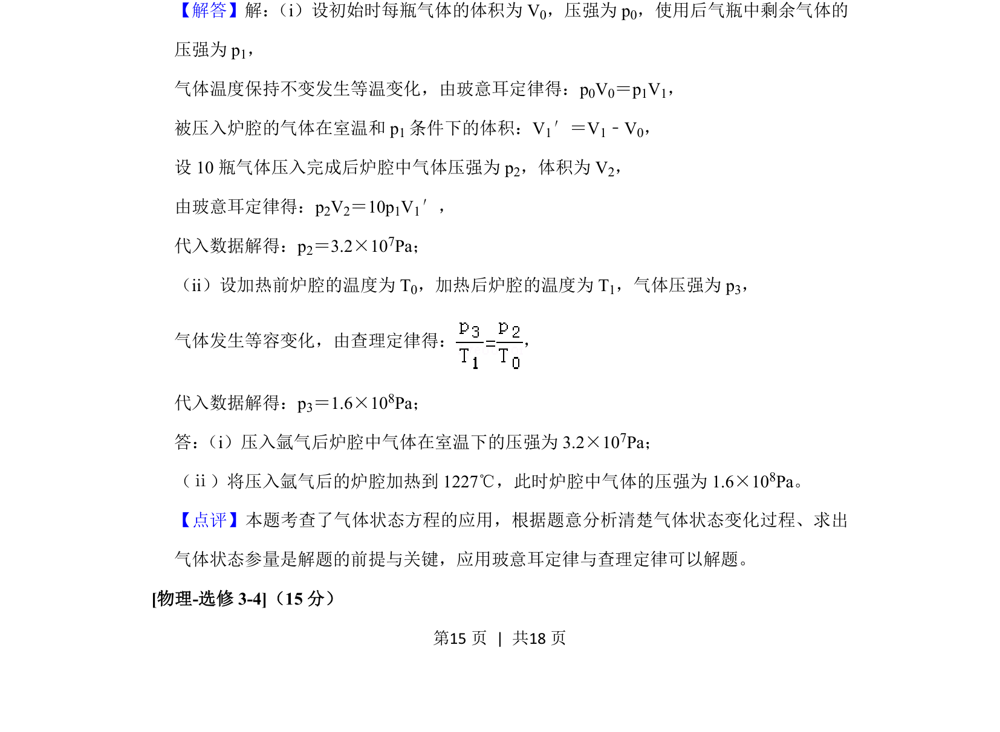

## 题面

## 摘要

本题通过热等静压设备情境，考查理想气体等温变化与等容变化规律及其应用。

## 关联考点

- [[444-玻意耳定律|玻意耳定律]]
- [[430-查理定律|查理定律]]
- [[446-理想气体状态方程|理想气体状态方程]]

## 答案与解析

> 📄 原 PDF 第 15 页：`素材/真题/湖南/2008-2024·（湖南）物理高考真题/2019年高考物理试卷（新课标Ⅰ）（解析卷）.pdf`
