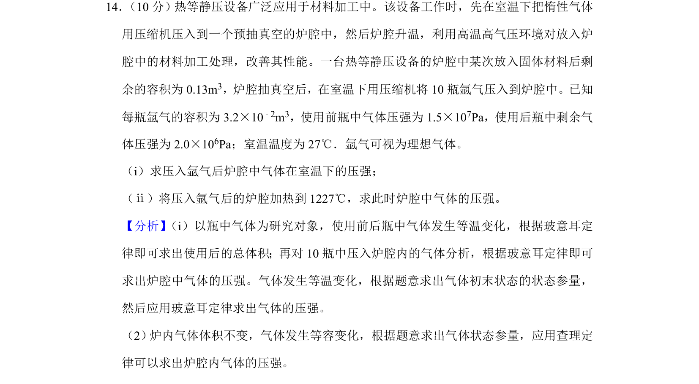
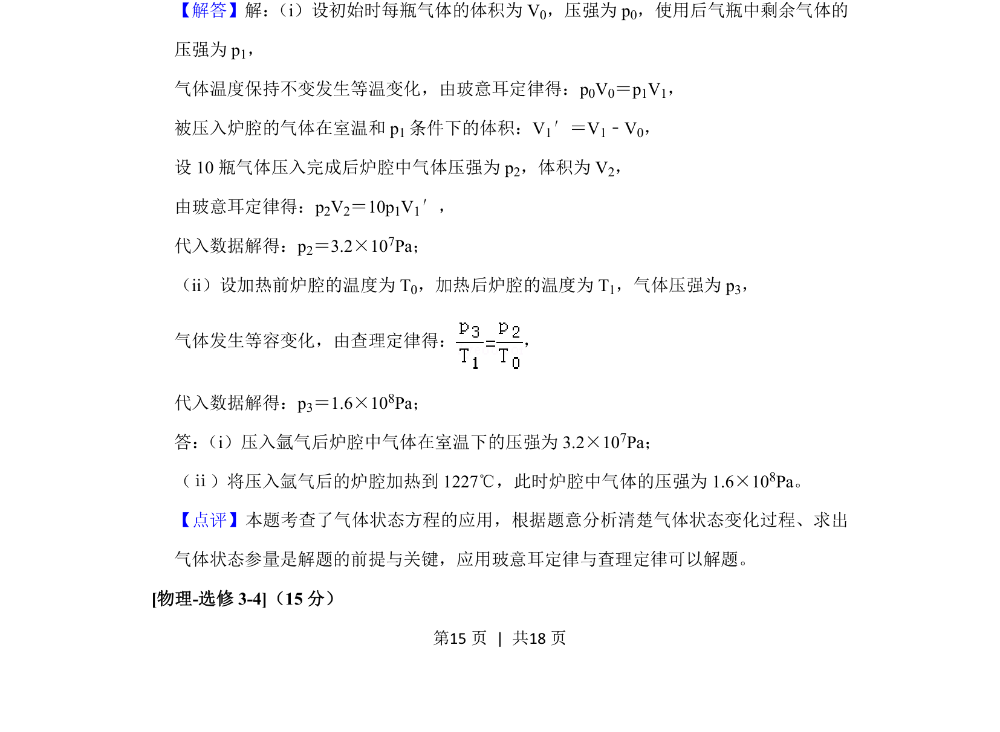

## 题面

## 摘要

本题通过热等静压设备情境，考查理想气体等温变化与等容变化规律及其应用。

## 关联考点

- [[444-玻意耳定律|玻意耳定律]]
- [[430-查理定律|查理定律]]
- [[446-理想气体状态方程|理想气体状态方程]]

## 答案与解析

> 📄 原 PDF 第 15 页：`素材/真题/湖南/2008-2024·（湖南）物理高考真题/2019年高考物理试卷（新课标Ⅰ）（解析卷）.pdf`

<!-- 题干文本-start -->
## 题干文本
14． （10分）热等静压设备广泛应用于材料加工中。该设备工作时，先在室温下把惰性气体
用压缩机压入到一个预抽真空的炉腔中，然后炉腔升温，利用高温高气压环境对放入炉
腔中的材料加工处理，改善其性能。一台热等静压设备的炉腔中某次放入固体材料后剩
余的容积为0.13m 3，炉腔抽真空后，在室温下用压缩机将10瓶氩气压入到炉腔中。已知
每瓶氩气的容积为3.2×10 ﹣2m3，使用前瓶中气体压强为1.5×10 7Pa，使用后瓶中剩余气
体压强为2.0×10 6Pa；室温温度为27℃．氩气可视为理想气体。
（i）求压入氩气后炉腔中气体在室温下的压强；
（ⅱ）将压入氩气后的炉腔加热到1227℃，求此时炉腔中气体的压强。
<!-- 题干文本-end -->

<!-- 解析文本-start -->
## 解析文本
【分析】 （i）以瓶中气体为研究对象，使用前后瓶中气体发生等温变化，根据玻意耳定
律即可求出使用后的总体积；再对10瓶中压入炉腔内的气体分析，根据玻意耳定律即可
求出炉腔中气体的压强。气体发生等温变化，根据题意求出气体初末状态的状态参量，
然后应用玻意耳定律求出气体的压强。
（2） 炉内气体体积不变，气体发生等容变化，根据题意求出气体状态参量，应用查理定
律可以求出炉腔内气体的压强。
【解答】解： （i）设初始时每瓶气体的体积为V0，压强为p 0，使用后气瓶中剩余气体的
压强为p 1，
气体温度保持不变发生等温变化，由玻意耳定律得：p0V0＝p1V1，
被压入炉腔的气体在室温和p 1条件下的体积：V1′＝V1﹣V0，
设10瓶气体压入完成后炉腔中气体压强为p 2，体积为V 2，
由玻意耳定律得：p2V2＝10p1V1′，
代入数据解得：p2＝3.2×107Pa；
（ii）设加热前炉腔的温度为T 0，加热后炉腔的温度为T 1，气体压强为p 3，
气体发生等容变化，由查理定律得： ，
代入数据解得：p3＝1.6×108Pa；
答： （i）压入氩气后炉腔中气体在室温下的压强为3.2×107Pa；
（ⅱ）将压入氩气后的炉腔加热到1227℃，此时炉腔中气体的压强为1.6×10 8Pa。
【点评】本题考查了气体状态方程的应用，根据题意分析清楚气体状态变化过程、求出
气体状态参量是解题的前提与关键，应用玻意耳定律与查理定律可以解题。
[物理-选修3-4]（15分）
<!-- 解析文本-end -->
