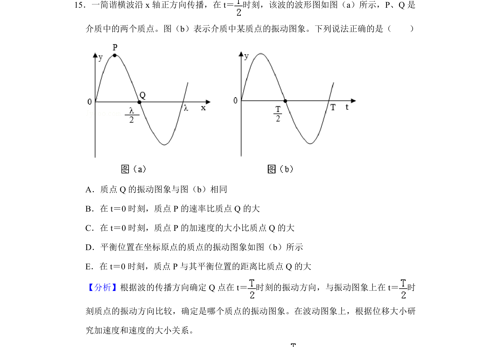
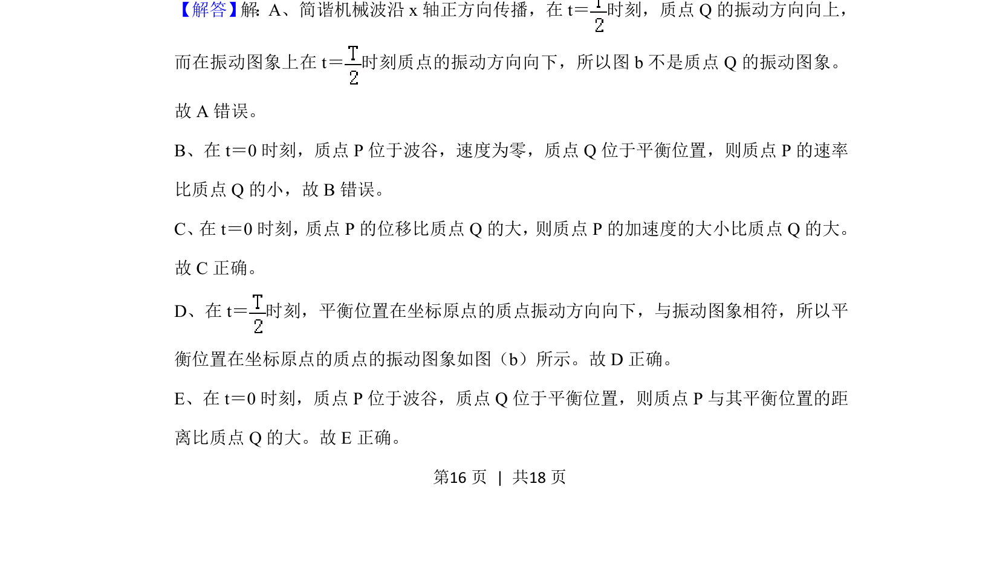
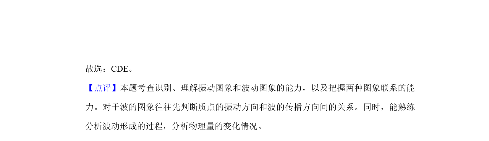

## 题面

## 摘要

简谐横波波形图与振动图象综合判断，涉及质点振动方向、速度、加速度及位移的分析。

## 关联考点

- [[波的传播方向与质点振动方向判断]]
- [[振动图象与波动图象的关联]]
- [[简谐运动的速度与加速度]]
- [[位移与平衡位置距离]]

## 答案与解析

> 📄 原 PDF 第 16 页：`素材/真题/湖南/2008-2024·（湖南）物理高考真题/2019年高考物理试卷（新课标Ⅰ）（解析卷）.pdf`
