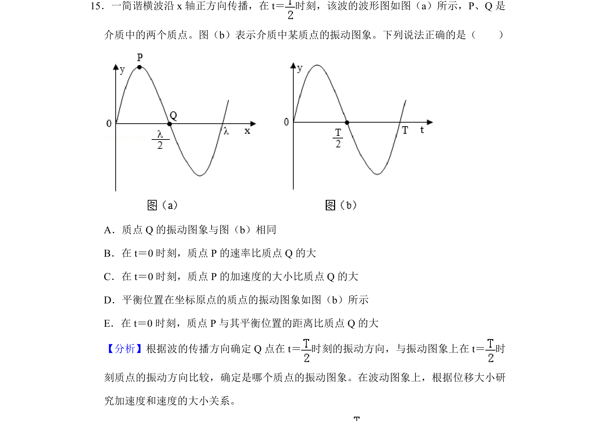
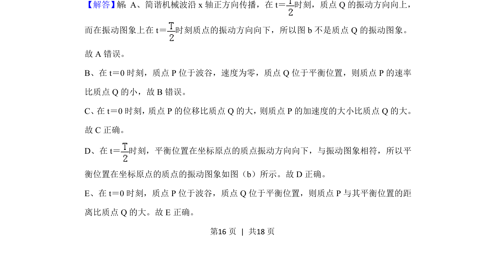
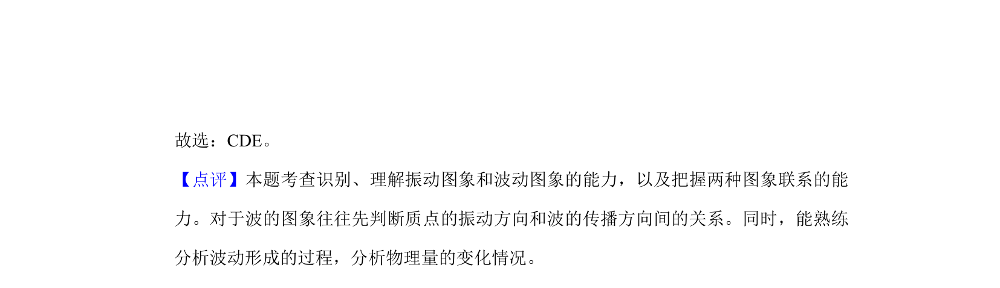

## 题面

## 摘要

简谐横波波形图与振动图象综合判断，涉及质点振动方向、速度、加速度及位移的分析。

## 关联考点

- [[波的传播方向与质点振动方向判断]]
- [[振动图象与波动图象的关联]]
- [[简谐运动的速度与加速度]]
- [[位移与平衡位置距离]]

## 答案与解析

> 📄 原 PDF 第 16 页：`素材/真题/湖南/2008-2024·（湖南）物理高考真题/2019年高考物理试卷（新课标Ⅰ）（解析卷）.pdf`

<!-- 题干文本-start -->
## 题干文本
15．一简谐横波沿x轴正方向传播，在t＝ 时刻，该波的波形图如图（a）所示，P、Q是
介质中的两个质点。图（b）表示介质中某质点的振动图象。下列说法正确的是（　　）
A．质点Q的振动图象与图（b）相同
B．在t＝0时刻，质点P的速率比质点Q的大
C．在t＝0时刻，质点P的加速度的大小比质点Q的大
D．平衡位置在坐标原点的质点的振动图象如图（b）所示
E．在t＝0时刻，质点P与其平衡位置的距离比质点Q的大
<!-- 题干文本-end -->

<!-- 解析文本-start -->
## 解析文本
【分析】根据波的传播方向确定Q点在t＝ 时刻的振动方向，与振动图象上在t＝ 时
刻质点的振动方向比较，确定是哪个质点的振动图象。在波动图象上，根据位移大小研
究加速度和速度的大小关系。
【解答】 解：A、简谐机械波沿x轴正方向传播，在t＝ 时刻，质点Q的振动方向向上，
而在振动图象上在t＝ 时刻质点的振动方向向下，所以图b不是质点Q的振动图象。
故A错误。
B、在t＝0时刻，质点P位于波谷，速度为零，质点Q位于平衡位置，则质点P的速率
比质点Q的小，故B错误。
C、 在t＝0时刻， 质点P的位移比质点Q的大， 则质点P的加速度的大小比质点Q的大。
故C正确。
D、在t＝ 时刻，平衡位置在坐标原点的质点振动方向向下，与振动图象相符，所以平
衡位置在坐标原点的质点的振动图象如图（b）所示。故D正确。
E、在t＝0时刻，质点P位于波谷，质点Q位于平衡位置，则质点P与其平衡位置的距
离比质点Q的大。故E正确。
<!-- 解析文本-end -->
