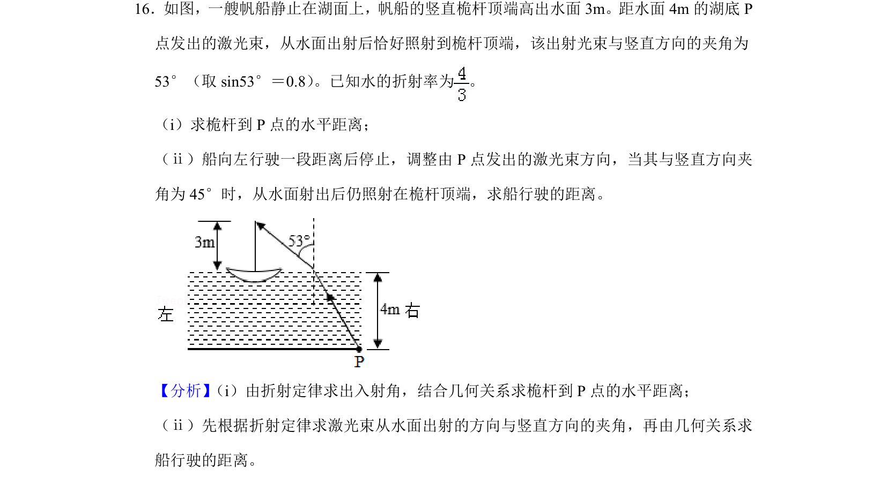
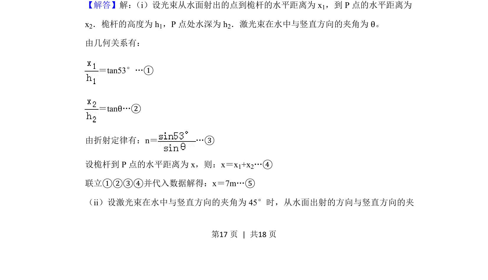
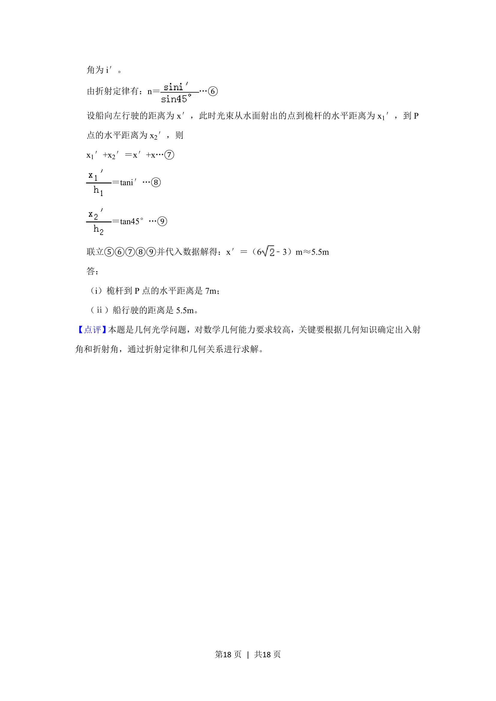

## 题面

## 摘要

考查光的折射定律与几何关系结合，求解水平距离及运动距离问题。

## 关联考点

- [[520-光的折射定律|光的折射定律]]
- [[455-几何光学|几何光学]]
- [[折射定律应用]]
- [[几何关系计算]]

## 答案与解析

> 📄 原 PDF 第 17 页：`素材/真题/湖南/2008-2024·（湖南）物理高考真题/2019年高考物理试卷（新课标Ⅰ）（解析卷）.pdf`

<!-- 题干文本-start -->
## 题干文本
16．如图，一艘帆船静止在湖面上，帆船的竖直桅杆顶端高出水面3m。距水面4m的湖底P
点发出的激光束，从水面出射后恰好照射到桅杆顶端，该出射光束与竖直方向的夹角为
53°（取sin53°＝0.8） 。已知水的折射率为 。
（i）求桅杆到P点的水平距离；
（ⅱ）船向左行驶一段距离后停止，调整由P点发出的激光束方向，当其与竖直方向夹
角为45°时，从水面射出后仍照射在桅杆顶端，求船行驶的距离。
<!-- 题干文本-end -->

<!-- 解析文本-start -->
## 解析文本
【分析】 （i）由折射定律求出入射角，结合几何关系求桅杆到P点的水平距离；
（ⅱ）先根据折射定律求激光束从水面出射的方向与竖直方向的夹角，再由几何关系求
船行驶的距离。
【解答】解： （i）设光束从水面射出的点到桅杆的水平距离为x1，到P点的水平距离为
x2．桅杆的高度为h 1，P点处水深为h 2．激光束在水中与竖直方向的夹角为θ。
由几何关系有：
＝tan53°…①
＝tanθ…②
由折射定律有：n＝…③
设桅杆到P点的水平距离为x，则：x＝x 1+x2…④
联立①②③④并代入数据解得：x＝7m…⑤
（ii）设激光束在水中与竖直方向的夹角为45°时，从水面出射的方向与竖直方向的夹
<!-- 解析文本-end -->
