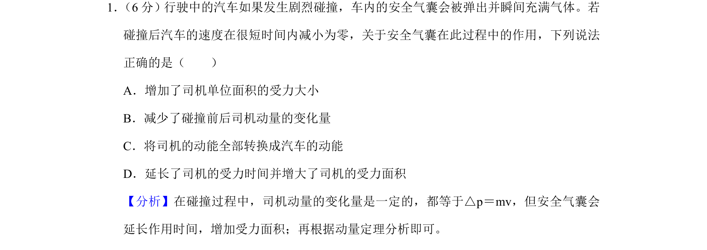
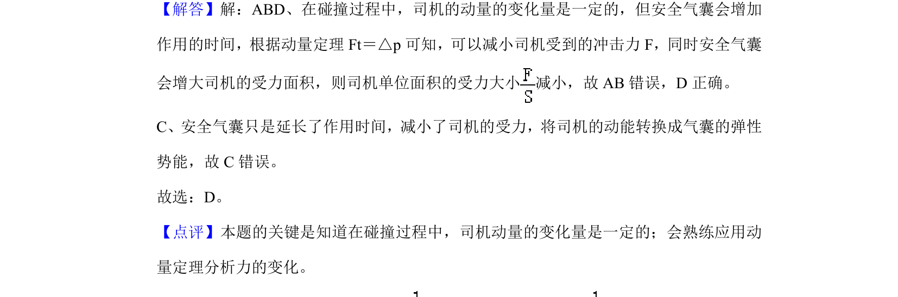

## 题面

## 摘要

安全气囊通过延长作用时间和增大受力面积减小冲击力，考查动量定理的应用。

## 关联考点

- [[349-动量定理|动量定理]]
- [[345-冲量|冲量]]
- [[动量变化量]]
- [[受力面积]]

## 答案与解析

> 📄 原 PDF 第 1 页：`素材/真题/湖南/2008-2024·（湖南）物理高考真题/2020年高考物理试卷（新课标Ⅰ）（解析卷）.pdf`
