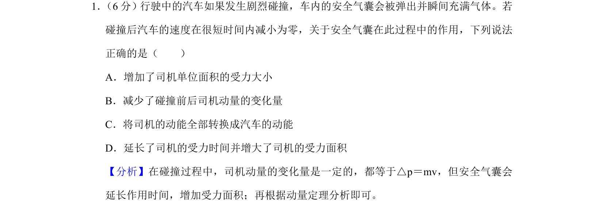
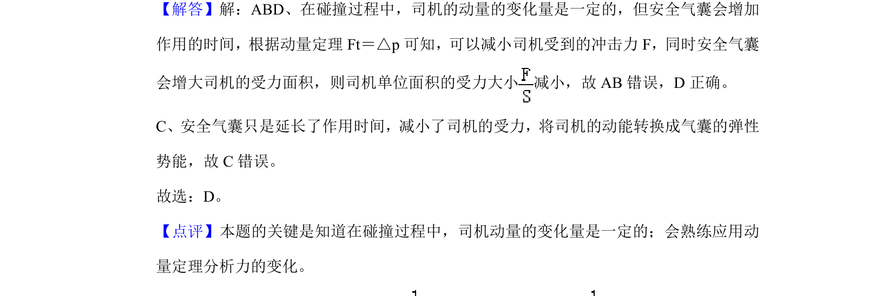

## 题面

## 摘要

安全气囊通过延长作用时间和增大受力面积减小冲击力，考查动量定理的应用。

## 关联考点

- [[349-动量定理|动量定理]]
- [[345-冲量|冲量]]
- [[动量变化量]]
- [[受力面积]]

## 答案与解析

> 📄 原 PDF 第 1 页：`素材/真题/湖南/2008-2024·（湖南）物理高考真题/2020年高考物理试卷（新课标Ⅰ）（解析卷）.pdf`

<!-- 题干文本-start -->
## 题干文本
1． （6分）行驶中的汽车如果发生剧烈碰撞，车内的安全气囊会被弹出并瞬间充满气体。若
碰撞后汽车的速度在很短时间内减小为零，关于安全气囊在此过程中的作用，下列说法
正确的是（　　）
A．增加了司机单位面积的受力大小
B．减少了碰撞前后司机动量的变化量
C．将司机的动能全部转换成汽车的动能
D．延长了司机的受力时间并增大了司机的受力面积
<!-- 题干文本-end -->

<!-- 解析文本-start -->
## 解析文本
【分析】在碰撞过程中，司机动量的变化量是一定的，都等于△p＝mv，但安全气囊会
延长作用时间，增加受力面积；再根据动量定理分析即可。
【解答】解：ABD、在碰撞过程中，司机的动量的变化量是一定的，但安全气囊会增加
作用的时间，根据动量定理Ft＝△p可知，可以减小司机受到的冲击力F，同时安全气囊
会增大司机的受力面积，则司机单位面积的受力大小 减小，故AB错误，D正确。
C、安全气囊只是延长了作用时间，减小了司机的受力，将司机的动能转换成气囊的弹性
势能，故C错误。
故选：D。
【点评】本题的关键是知道在碰撞过程中，司机动量的变化量是一定的；会熟练应用动
量定理分析力的变化。
<!-- 解析文本-end -->
