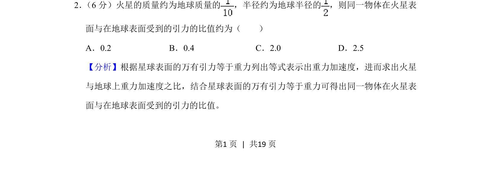
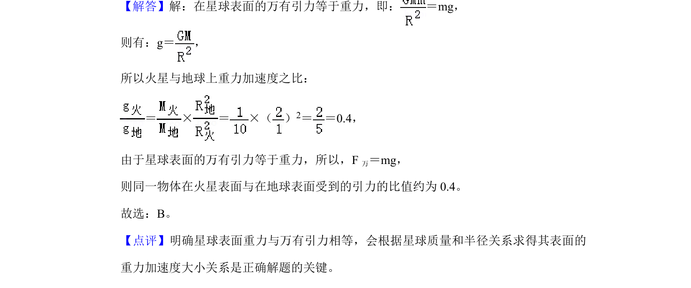

## 题面

## 摘要

根据万有引力定律和天体表面重力近似等于引力，求火星与地球表面引力比值。

## 关联考点

- [[246-万有引力定律|万有引力定律]]
- [[115-重力加速度-初中|重力加速度]]
- [[比例法]]

## 答案与解析

> 📄 原 PDF 第 1 页：`素材/真题/湖南/2008-2024·（湖南）物理高考真题/2020年高考物理试卷（新课标Ⅰ）（解析卷）.pdf`
