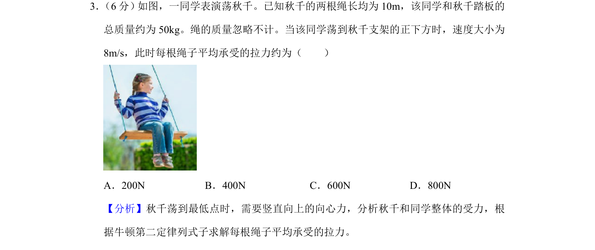
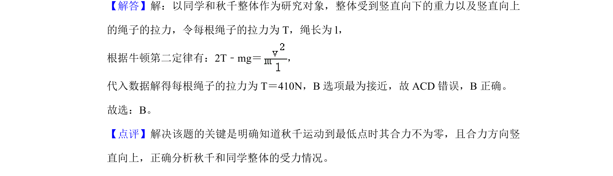

## 题面

## 摘要

荡秋千最低点，利用牛顿第二定律求绳拉力，涉及竖直面圆周运动向心力计算。

## 关联考点

- [[229-牛顿第二定律|牛顿第二定律]]
- [[256-向心力|向心力]]
- [[460-受力分析|受力分析]]

## 答案与解析

> 📄 原 PDF 第 2 页：`素材/真题/湖南/2008-2024·（湖南）物理高考真题/2020年高考物理试卷（新课标Ⅰ）（解析卷）.pdf`
