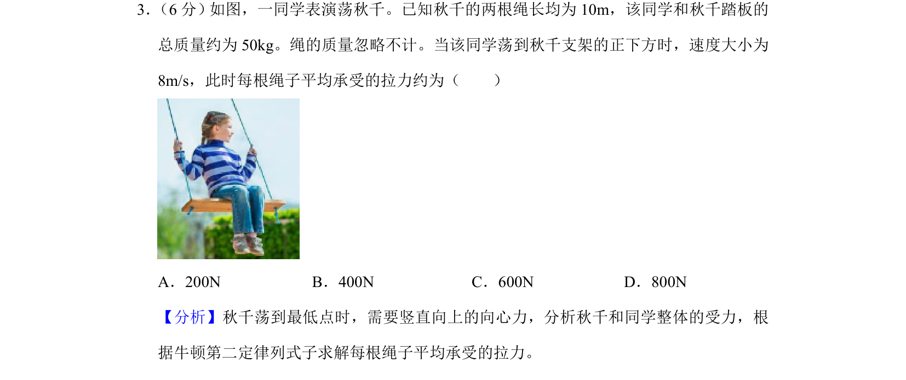
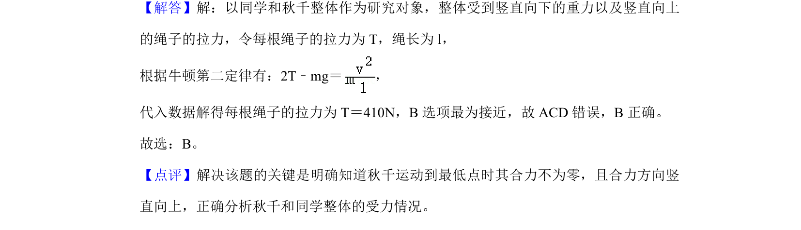

## 题面

## 摘要

荡秋千最低点，利用牛顿第二定律求绳拉力，涉及竖直面圆周运动向心力计算。

## 关联考点

- [[229-牛顿第二定律|牛顿第二定律]]
- [[256-向心力|向心力]]
- [[460-受力分析|受力分析]]

## 答案与解析

> 📄 原 PDF 第 2 页：`素材/真题/湖南/2008-2024·（湖南）物理高考真题/2020年高考物理试卷（新课标Ⅰ）（解析卷）.pdf`

<!-- 题干文本-start -->
## 题干文本
3． （6分）如图，一同学表演荡秋千。已知秋千的两根绳长均为10m，该同学和秋千踏板的
总质量约为50kg。绳的质量忽略不计。当该同学荡到秋千支架的正下方时，速度大小为
8m/s，此时每根绳子平均承受的拉力约为（　　）
A．200N B．400N C．600N D．800N
<!-- 题干文本-end -->

<!-- 解析文本-start -->
## 解析文本
【分析】秋千荡到最低点时，需要竖直向上的向心力，分析秋千和同学整体的受力，根
据牛顿第二定律列式子求解每根绳子平均承受的拉力。
【解答】解：以同学和秋千整体作为研究对象，整体受到竖直向下的重力以及竖直向上
的绳子的拉力，令每根绳子的拉力为T，绳长为l，
根据牛顿第二定律有：2T﹣mg＝ ，
代入数据解得每根绳子的拉力为T＝410N，B选项最为接近，故ACD错误，B正确。
故选：B。
【点评】解决该题的关键是明确知道秋千运动到最低点时其合力不为零，且合力方向竖
直向上，正确分析秋千和同学整体的受力情况。
<!-- 解析文本-end -->
