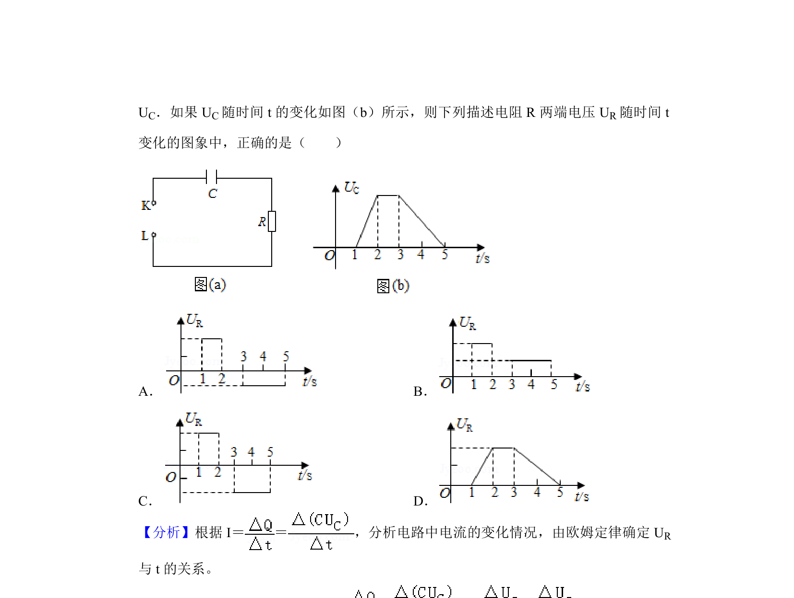
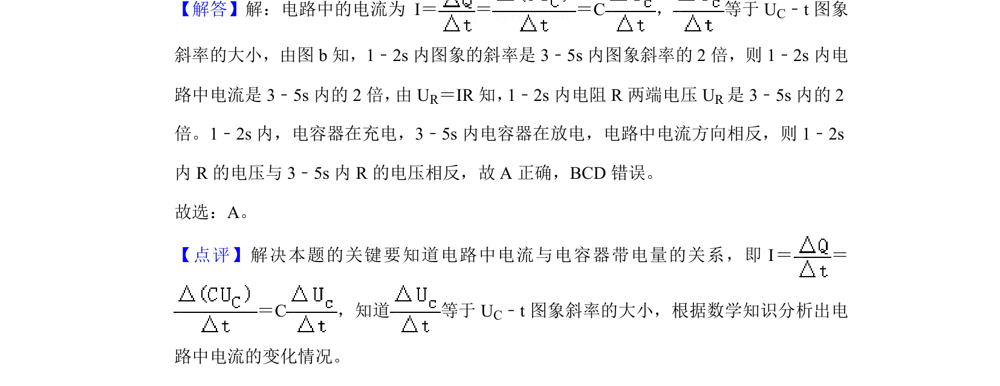

## 题面

## 摘要

电路与电容器结合，通过智能电源控制电容器电压变化的动态过程分析。

## 关联考点

- [[313-电容器|电容器]]
- [[516-充放电|充放电]]
- [[电路动态分析]]
- [[电压控制]]

## 答案与解析

> 📄 原 PDF 第 2 页：`素材/真题/湖南/2008-2024·（湖南）物理高考真题/2020年高考物理试卷（新课标Ⅰ）（解析卷）.pdf`
