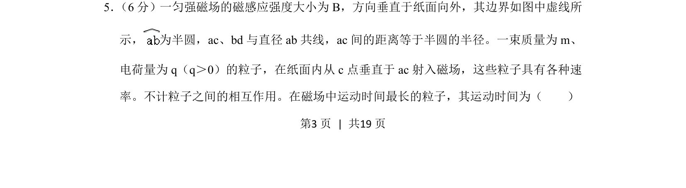
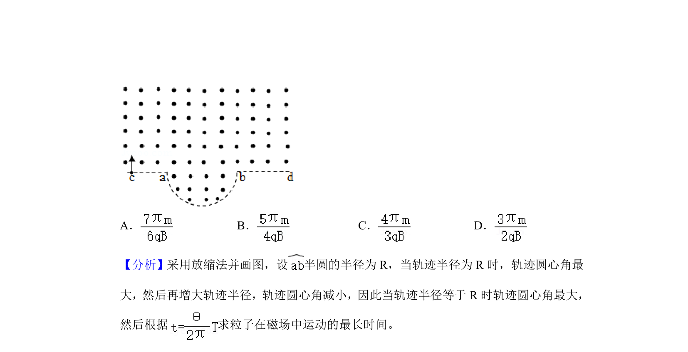
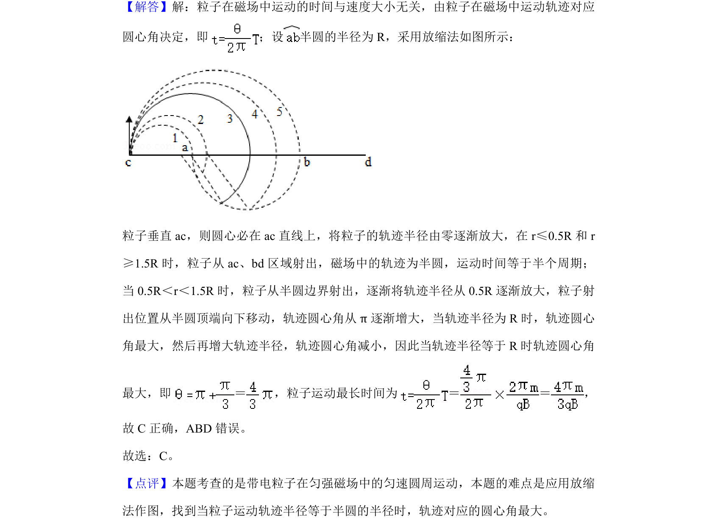

## 题面

## 摘要

带电粒子在匀强磁场中运动，求运动时间最长的粒子对应的时间。

## 关联考点

- [[带电粒子在磁场中的匀速圆周运动]]
- [[304-洛伦兹力|洛伦兹力]]
- [[周期与圆心角]]
- [[506-临界条件|临界条件]]

## 答案与解析

> 📄 原 PDF 第 3 页：`素材/真题/湖南/2008-2024·（湖南）物理高考真题/2020年高考物理试卷（新课标Ⅰ）（解析卷）.pdf`
