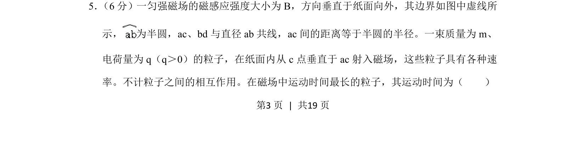
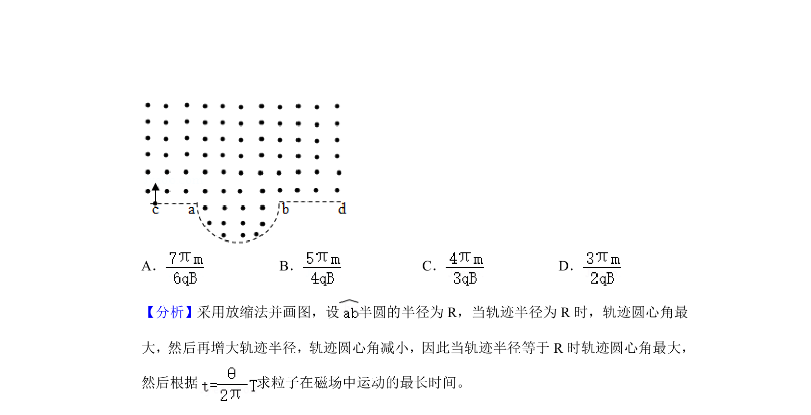
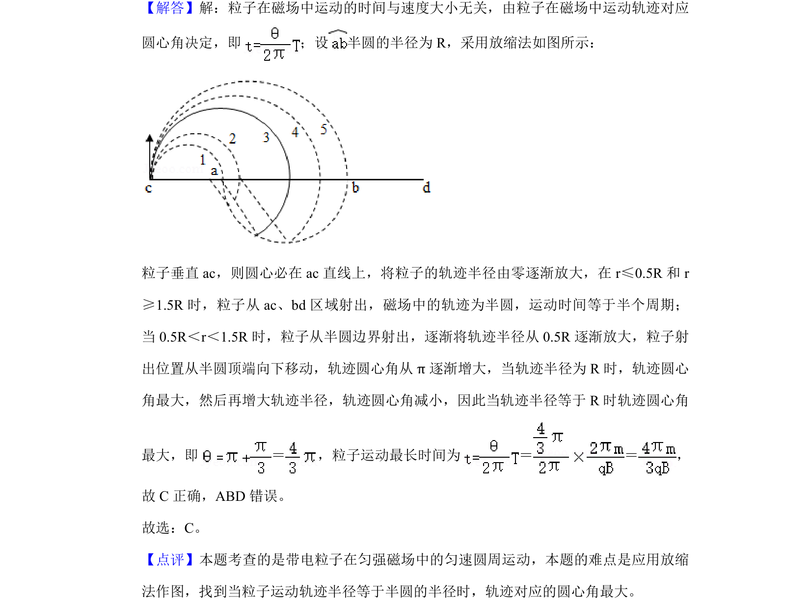

## 题面

## 摘要

带电粒子在匀强磁场中运动，求运动时间最长的粒子对应的时间。

## 关联考点

- [[带电粒子在磁场中的匀速圆周运动]]
- [[304-洛伦兹力|洛伦兹力]]
- [[周期与圆心角]]
- [[506-临界条件|临界条件]]

## 答案与解析

> 📄 原 PDF 第 3 页：`素材/真题/湖南/2008-2024·（湖南）物理高考真题/2020年高考物理试卷（新课标Ⅰ）（解析卷）.pdf`

<!-- 题干文本-start -->
## 题干文本
5． （6分）一匀强磁场的磁感应强度大小为B，方向垂直于纸面向外，其边界如图中虚线所
示， 为半圆，ac、bd与直径ab共线，ac间的距离等于半圆的半径。一束质量为m、
电荷量为q（q＞0）的粒子，在纸面内从c点垂直于ac射入磁场，这些粒子具有各种速
率。不计粒子之间的相互作用。在磁场中运动时间最长的粒子，其运动时间为（　　）
<!-- 题干文本-end -->

<!-- 解析文本-start -->
## 解析文本

<!-- 解析文本-end -->
