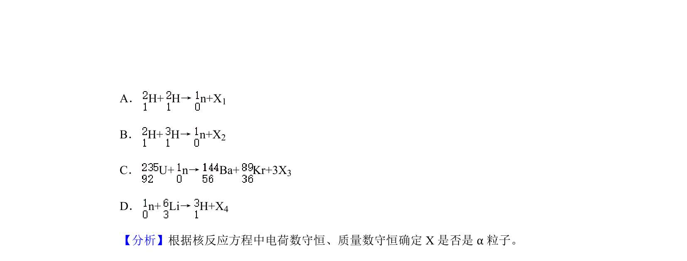
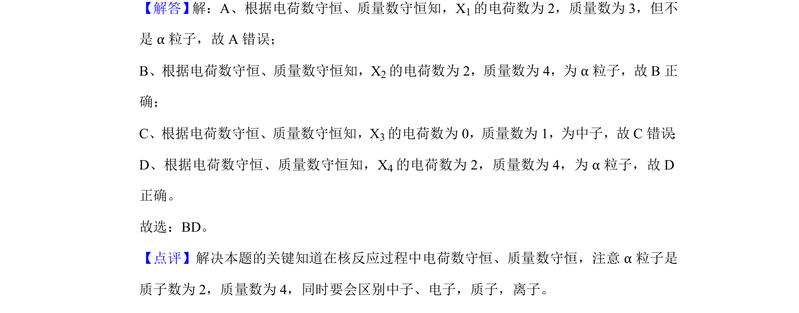

## 题面

## 摘要

考查核反应方程中α粒子的识别，需根据质量数和电荷数守恒判断。

## 关联考点

- [[629-核反应方程|核反应方程]]
- [[α粒子]]
- [[728-质量数守恒|质量数守恒]]
- [[689-电荷数守恒|电荷数守恒]]

## 答案与解析

> 📄 原 PDF 第 4 页：`素材/真题/湖南/2008-2024·（湖南）物理高考真题/2020年高考物理试卷（新课标Ⅰ）（解析卷）.pdf`
