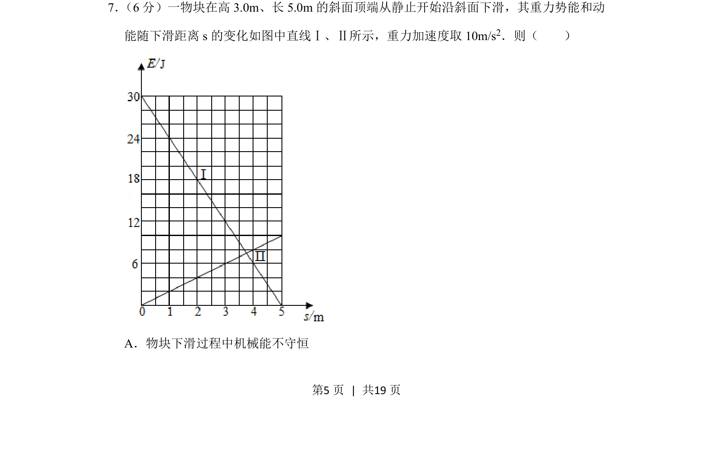
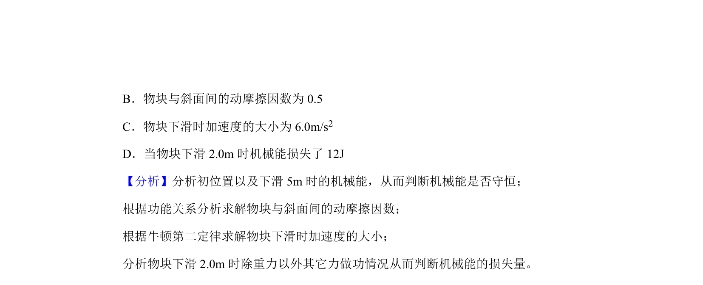
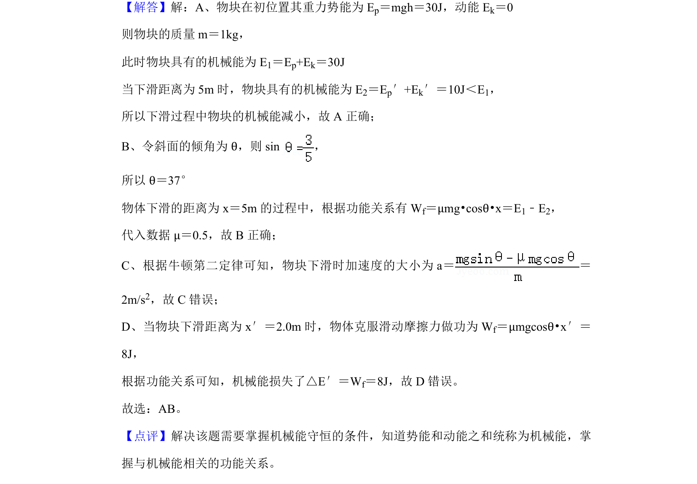

## 题面

## 摘要

物块沿斜面下滑，通过重力势能与动能随下滑距离变化的图像判断机械能是否守恒。

## 关联考点

- [[085-机械能守恒-初中|机械能守恒]]
- [[249-功能关系|功能关系]]
- [[运动图像分析]]

## 答案与解析

> 📄 原 PDF 第 5 页：`素材/真题/湖南/2008-2024·（湖南）物理高考真题/2020年高考物理试卷（新课标Ⅰ）（解析卷）.pdf`
