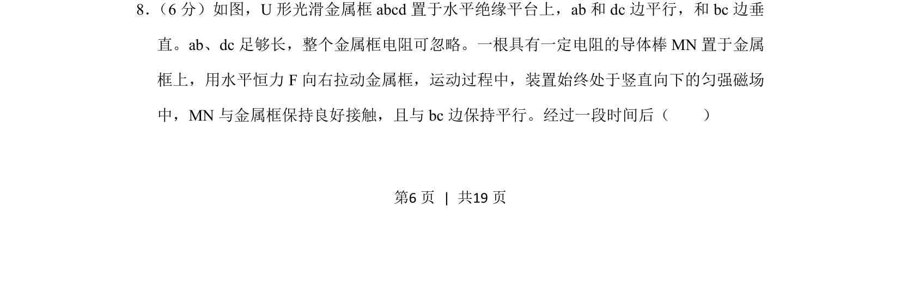
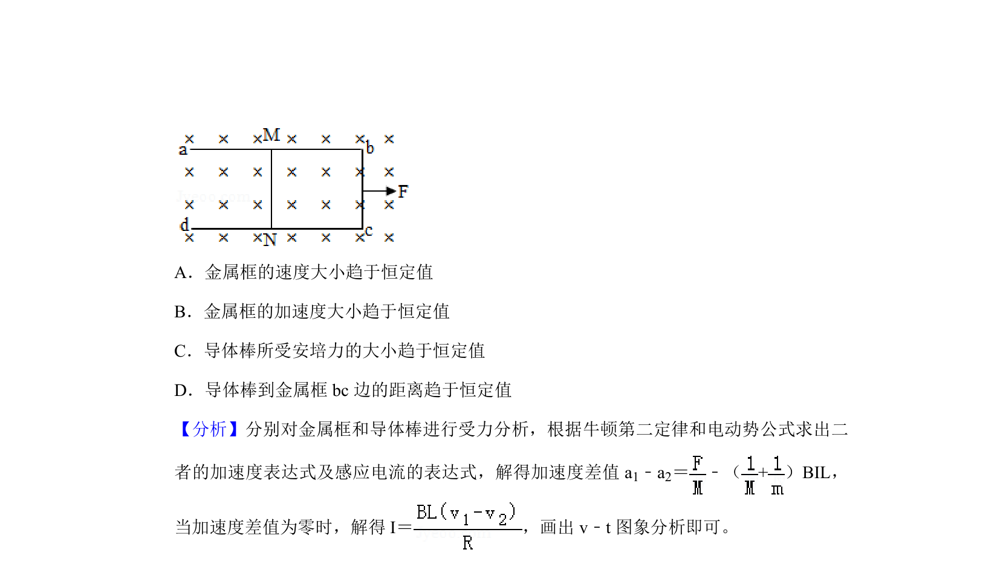
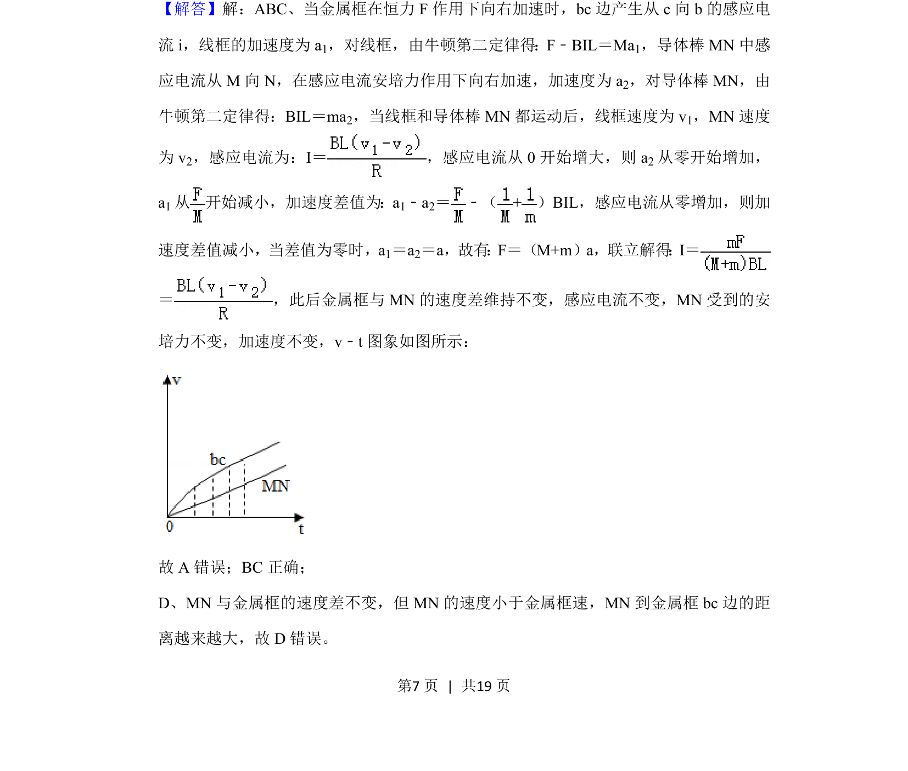
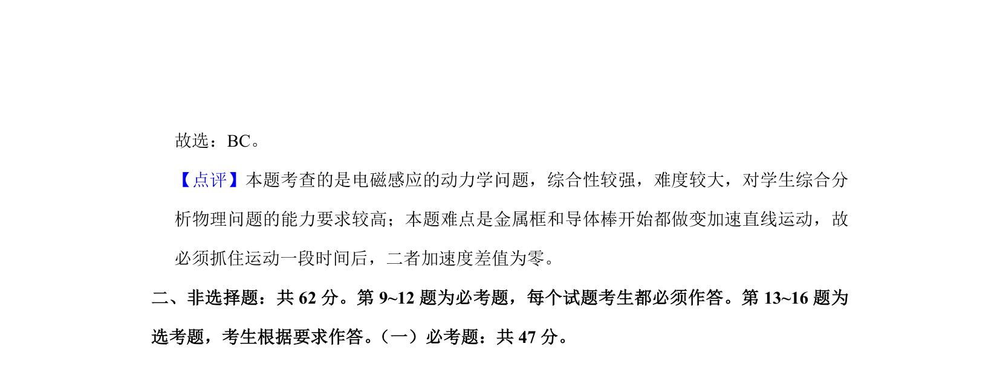

## 题面

## 摘要

金属框与导体棒在匀强磁场中相对运动，考查电磁感应、安培力与运动学综合问题。

## 关联考点

- [[175-电磁感应|电磁感应]]
- [[188-磁场对通电导体的作用|安培力]]
- [[1175-牛顿运动定律|牛顿运动定律]]
- [[280-相对运动|相对运动]]

## 答案与解析

> 📄 原 PDF 第 6 页：`素材/真题/湖南/2008-2024·（湖南）物理高考真题/2020年高考物理试卷（新课标Ⅰ）（解析卷）.pdf`
