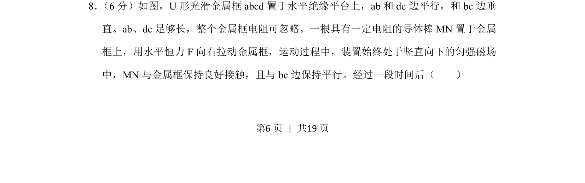
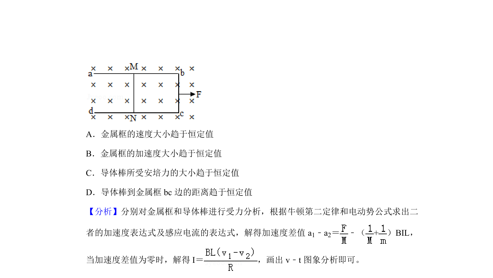
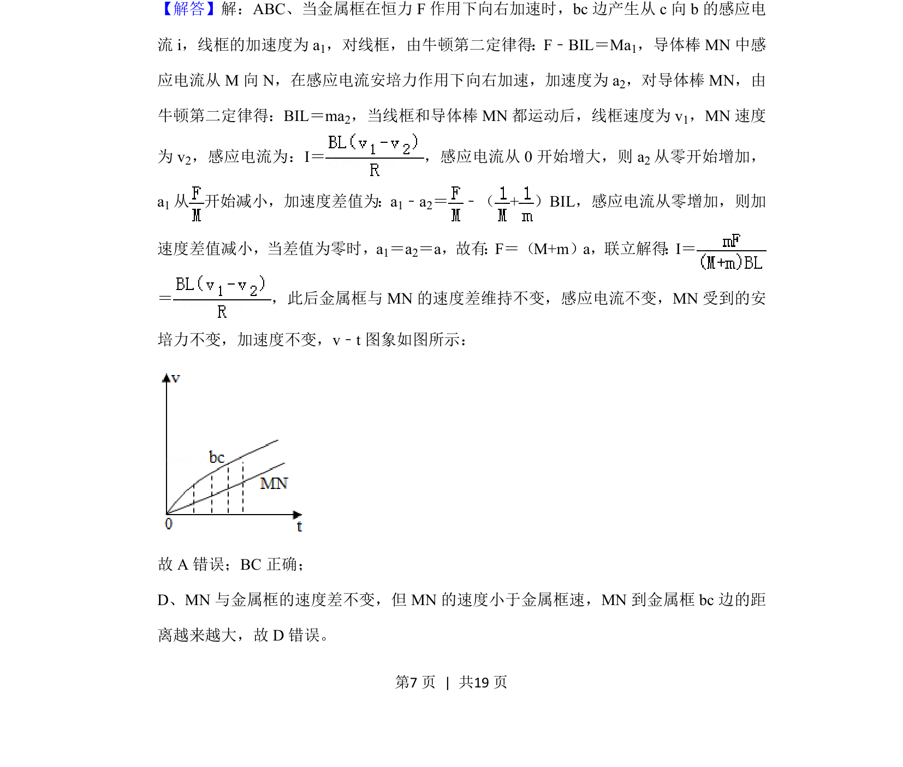
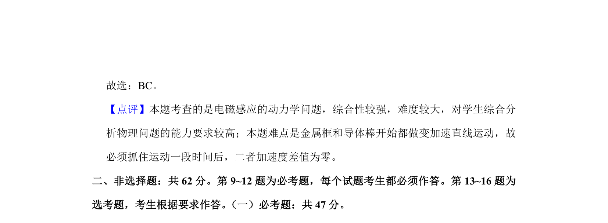

## 题面

## 摘要

金属框与导体棒在匀强磁场中相对运动，考查电磁感应、安培力与运动学综合问题。

## 关联考点

- [[175-电磁感应|电磁感应]]
- [[188-磁场对通电导体的作用|安培力]]
- [[1175-牛顿运动定律|牛顿运动定律]]
- [[280-相对运动|相对运动]]

## 答案与解析

> 📄 原 PDF 第 6 页：`素材/真题/湖南/2008-2024·（湖南）物理高考真题/2020年高考物理试卷（新课标Ⅰ）（解析卷）.pdf`

<!-- 题干文本-start -->
## 题干文本
8． （6分）如图，U形光滑金属框abcd置于水平绝缘平台上，ab和dc边平行，和bc边垂
直。ab、dc足够长，整个金属框电阻可忽略。一根具有一定电阻的导体棒MN置于金属
框上，用水平恒力F向右拉动金属框，运动过程中，装置始终处于竖直向下的匀强磁场
中，MN与金属框保持良好接触，且与bc边保持平行。经过一段时间后（　　）
<!-- 题干文本-end -->

<!-- 解析文本-start -->
## 解析文本

<!-- 解析文本-end -->
