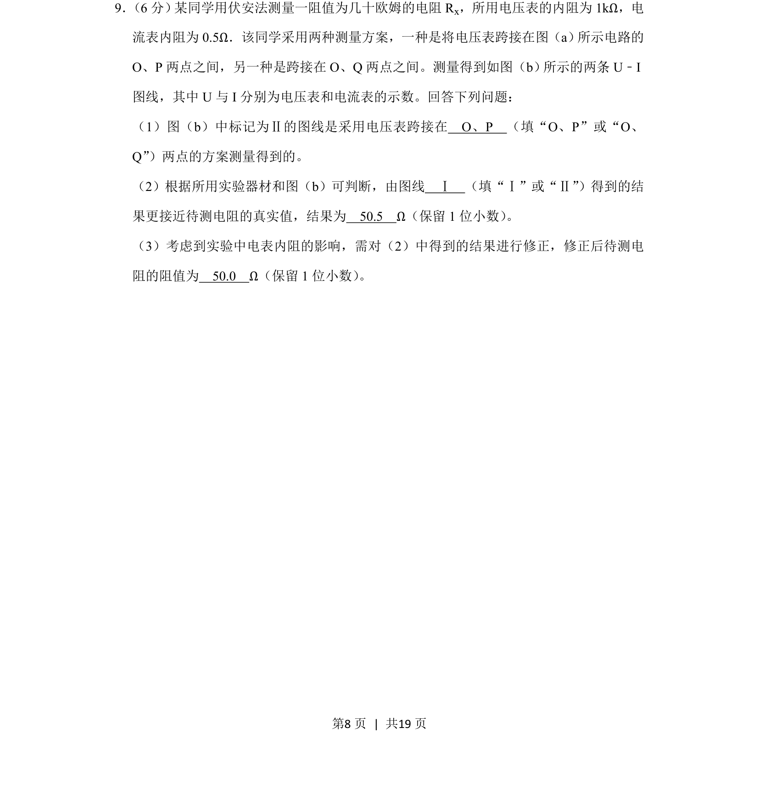
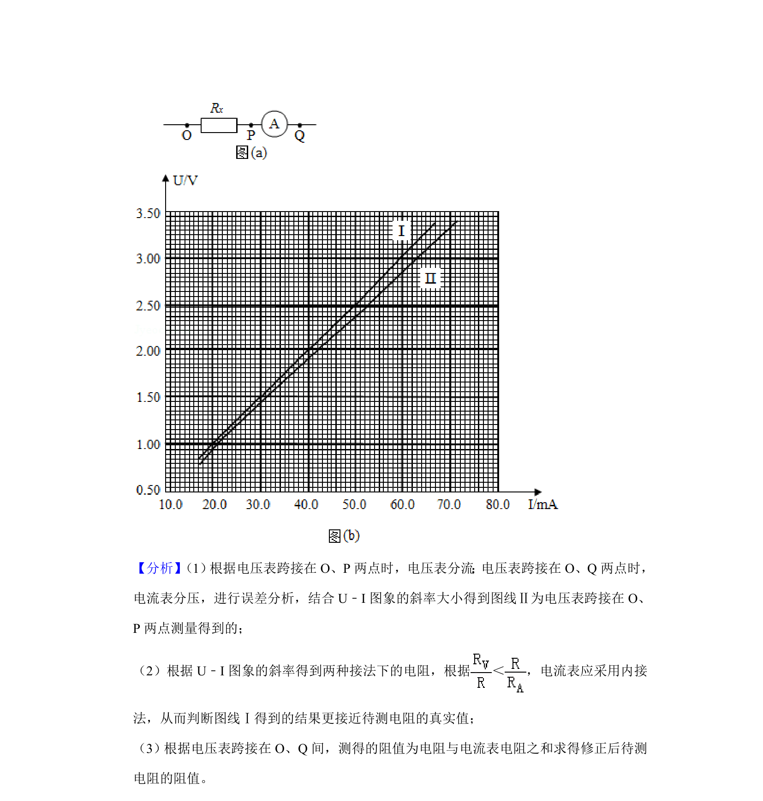
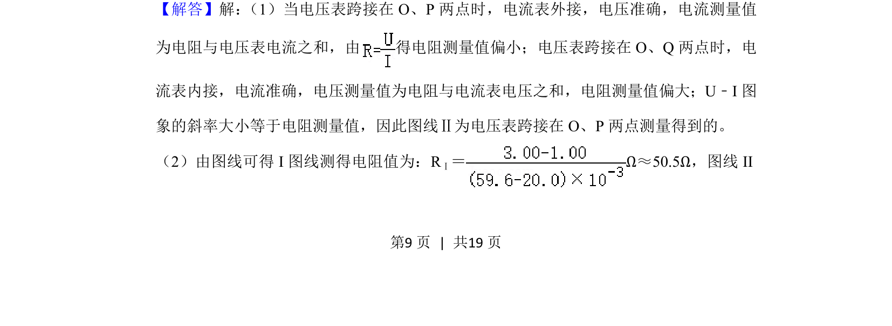
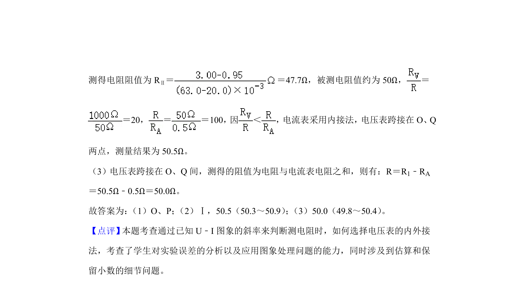

## 题面

## 摘要

用伏安法测量电阻，通过U-I图线判断内外接法并修正电表内阻影响。

## 关联考点

- [[511-伏安法测电阻|伏安法测电阻]]
- [[833-电流表内外接|电流表内外接]]
- [[724-误差分析|误差分析]]
- [[U-I图线]]

## 答案与解析

> 📄 原 PDF 第 8 页：`素材/真题/湖南/2008-2024·（湖南）物理高考真题/2020年高考物理试卷（新课标Ⅰ）（解析卷）.pdf`
