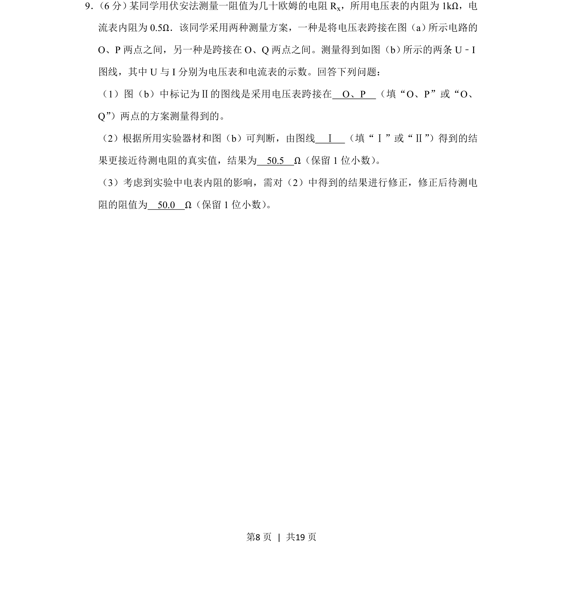
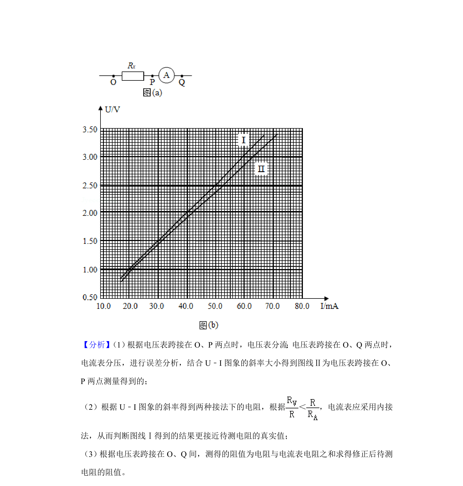
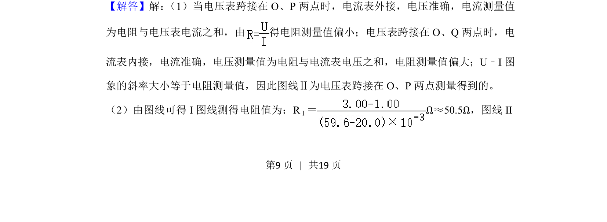
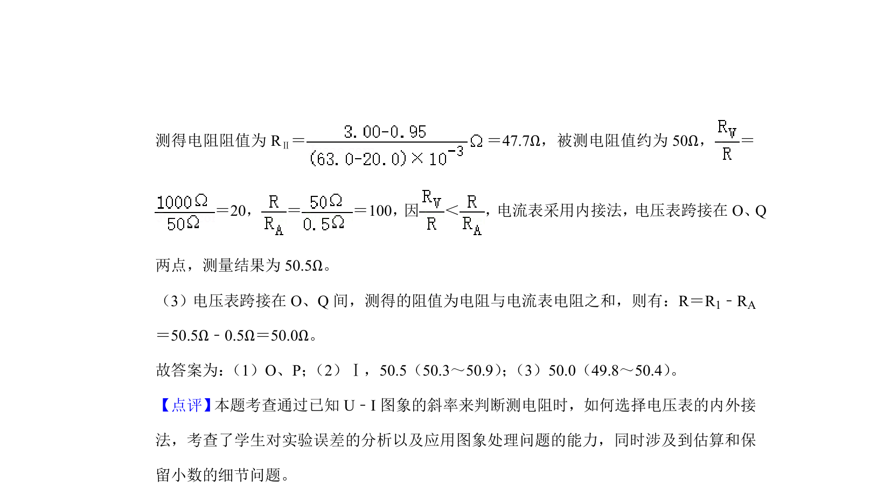

## 题面

## 摘要

用伏安法测量电阻，通过U-I图线判断内外接法并修正电表内阻影响。

## 关联考点

- [[511-伏安法测电阻|伏安法测电阻]]
- [[833-电流表内外接|电流表内外接]]
- [[724-误差分析|误差分析]]
- [[U-I图线]]

## 答案与解析

> 📄 原 PDF 第 8 页：`素材/真题/湖南/2008-2024·（湖南）物理高考真题/2020年高考物理试卷（新课标Ⅰ）（解析卷）.pdf`

<!-- 题干文本-start -->
## 题干文本
9． （6分） 某同学用伏安法测量一阻值为几十欧姆的电阻Rx，所用电压表的内阻为1kΩ，电
流表内阻为0.5Ω．该同学采用两种测量方案，一种是将电压表跨接在图（a） 所示电路的
O、P两点之间，另一种是跨接在O、Q两点之间。测量得到如图（b） 所示的两条U﹣I
图线，其中U与I分别为电压表和电流表的示数。回答下列问题：
（1）图（b）中标记为Ⅱ的图线是采用电压表跨接在　O、P　（填“O、P”或“O、
Q”）两点的方案测量得到的。
（2）根据所用实验器材和图（b）可判断，由图线　Ⅰ　（填“Ⅰ”或“Ⅱ”）得到的结
果更接近待测电阻的真实值，结果为　50.5　Ω（保留1位小数） 。
（3）考虑到实验中电表内阻的影响，需对（2）中得到的结果进行修正，修正后待测电
阻的阻值为　50.0　Ω（保留1位小数） 。
<!-- 题干文本-end -->

<!-- 解析文本-start -->
## 解析文本

<!-- 解析文本-end -->
