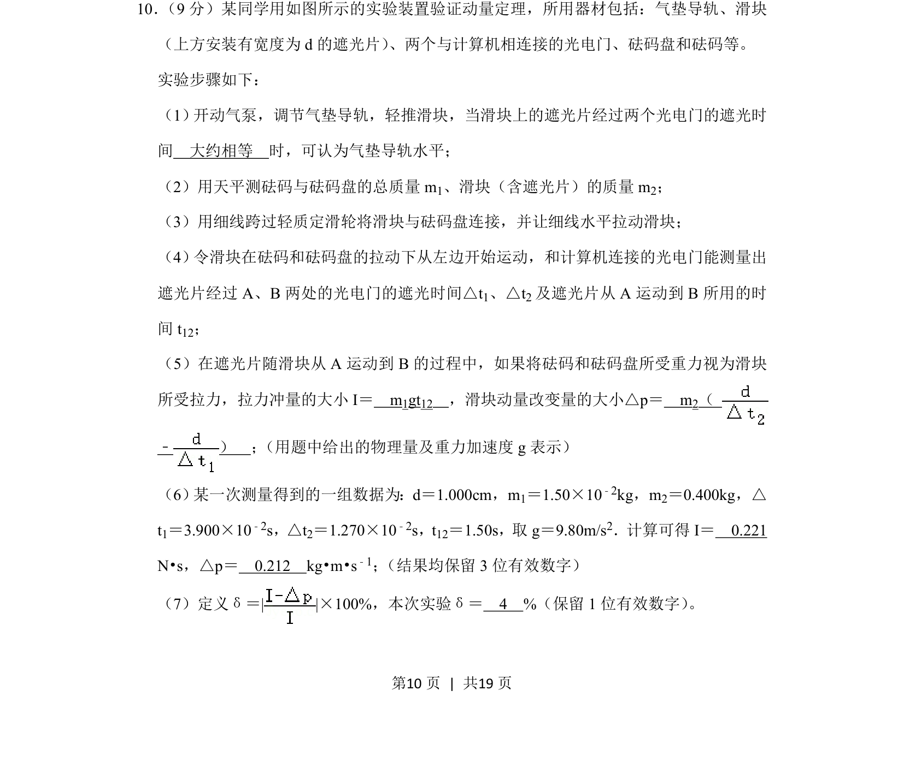
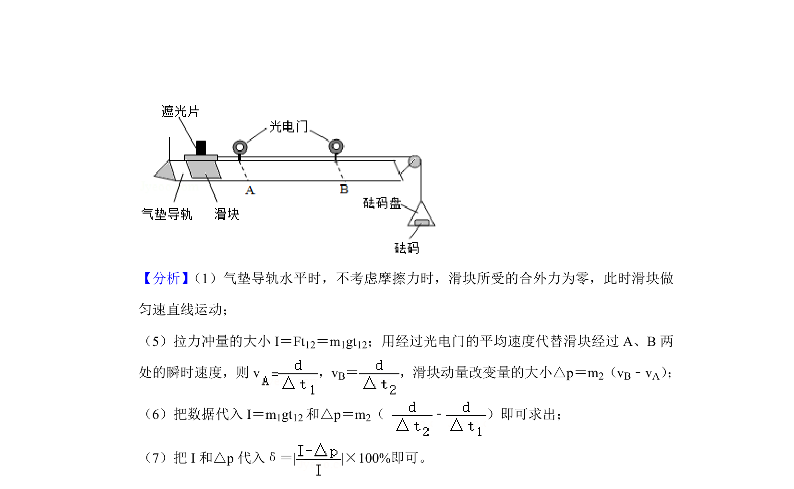
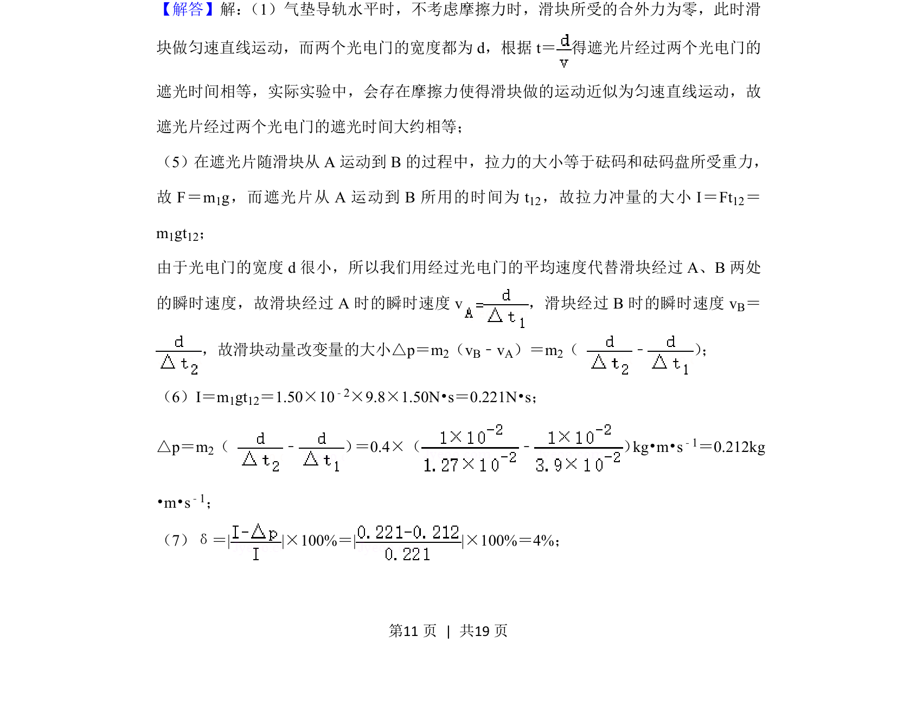
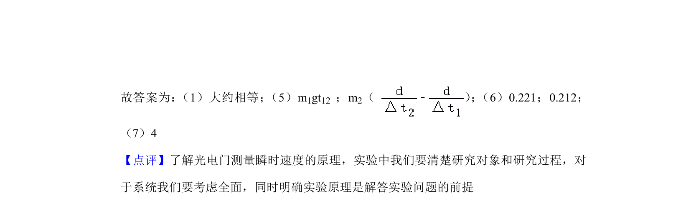

## 题面

## 摘要

该题考查用气垫导轨和光电门验证动量定理的实验，涉及冲量和动量改变量的计算及误差分析。

## 关联考点

- [[349-动量定理|动量定理]]
- [[345-冲量|冲量]]
- [[346-动量|动量]]
- [[724-误差分析|实验误差]]

## 答案与解析

> 📄 原 PDF 第 10 页：`素材/真题/湖南/2008-2024·（湖南）物理高考真题/2020年高考物理试卷（新课标Ⅰ）（解析卷）.pdf`
