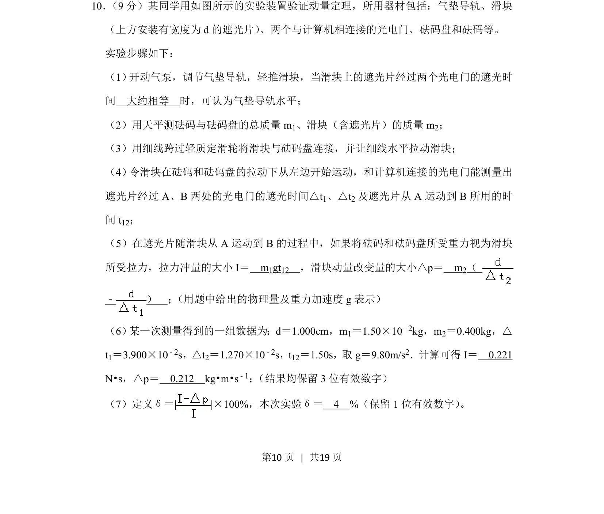
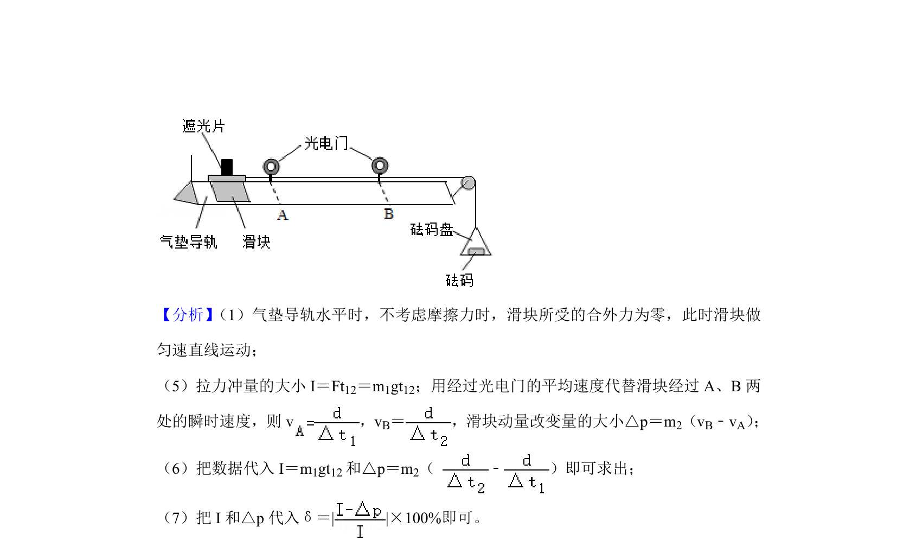
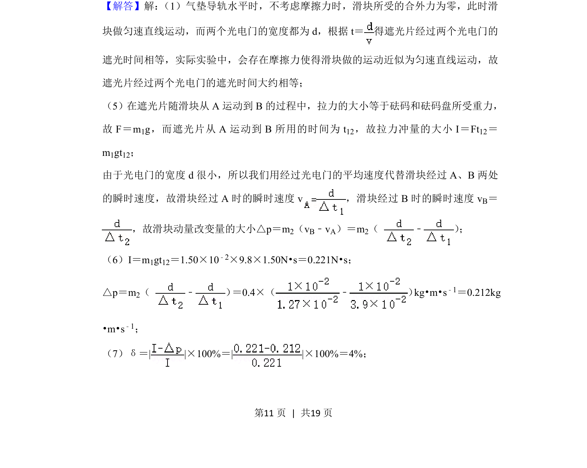
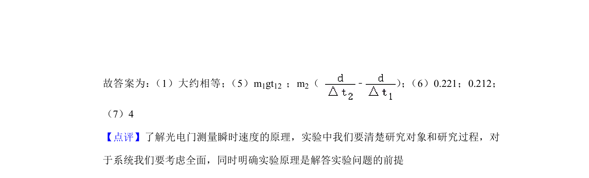

## 题面

## 摘要

该题考查用气垫导轨和光电门验证动量定理的实验，涉及冲量和动量改变量的计算及误差分析。

## 关联考点

- [[349-动量定理|动量定理]]
- [[345-冲量|冲量]]
- [[346-动量|动量]]
- [[724-误差分析|实验误差]]

## 答案与解析

> 📄 原 PDF 第 10 页：`素材/真题/湖南/2008-2024·（湖南）物理高考真题/2020年高考物理试卷（新课标Ⅰ）（解析卷）.pdf`

<!-- 题干文本-start -->
## 题干文本
10． （9分）某同学用如图所示的实验装置验证动量定理，所用器材包括：气垫导轨、滑块
（上方安装有宽度为d的遮光片） 、两个与计算机相连接的光电门、砝码盘和砝码等。
实验步骤如下：
（1） 开动气泵，调节气垫导轨，轻推滑块，当滑块上的遮光片经过两个光电门的遮光时
间　大约相等　时，可认为气垫导轨水平；
（2）用天平测砝码与砝码盘的总质量m 1、滑块（含遮光片）的质量m 2；
（3）用细线跨过轻质定滑轮将滑块与砝码盘连接，并让细线水平拉动滑块；
（4） 令滑块在砝码和砝码盘的拉动下从左边开始运动，和计算机连接的光电门能测量出
遮光片经过A、B两处的光电门的遮光时间△t 1、△t2及遮光片从A运动到B所用的时
间t 12；
（5）在遮光片随滑块从A运动到B的过程中，如果将砝码和砝码盘所受重力视为滑块
所受拉力，拉力冲量的大小I＝　m 1gt12　，滑块动量改变量的大小△p＝　m2（ 
﹣ ）　； （用题中给出的物理量及重力加速度g表示）
（6） 某一次测量得到的一组数据为：d＝1.000cm，m1＝1.50×10﹣2kg，m2＝0.400kg，△
t1＝3.900×10﹣2s，△t2＝1.270×10﹣2s，t12＝1.50s，取g＝9.80m/s 2．计算可得I＝　0.221　
N•s，△p＝　0.212　kg•m•s﹣1； （结果均保留3位有效数字）
（7）定义δ＝| |×100%，本次实验δ＝　4　%（保留1位有效数字） 。
<!-- 题干文本-end -->

<!-- 解析文本-start -->
## 解析文本

<!-- 解析文本-end -->
