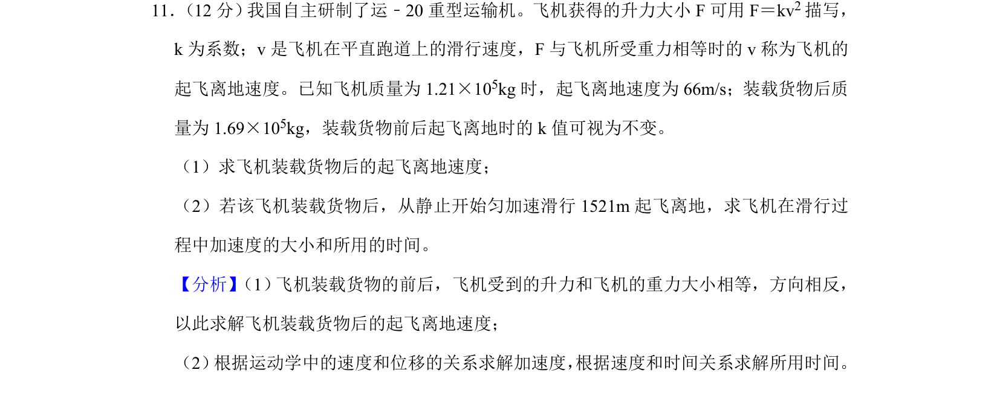
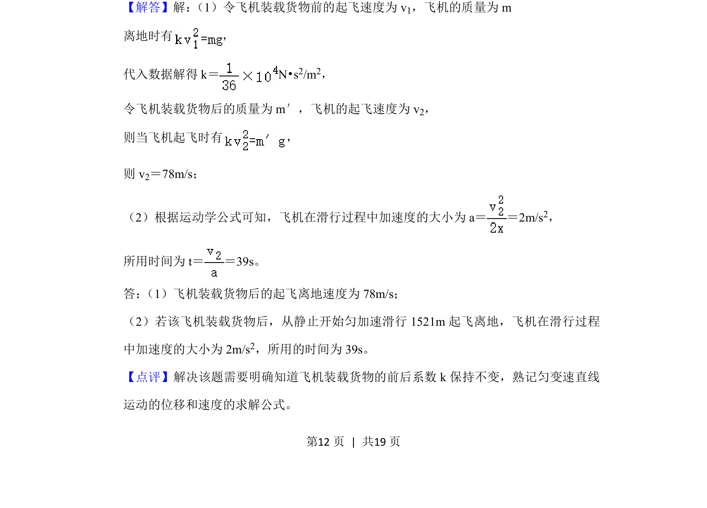

## 题面

## 摘要

飞机升力与重力平衡求起飞速度，结合匀变速直线运动公式求加速度和时间。

## 关联考点

- [[208-共点力平衡|共点力平衡]]
- [[795-匀变速直线运动规律|匀变速直线运动规律]]
- [[229-牛顿第二定律|牛顿第二定律]]

## 答案与解析

> 📄 原 PDF 第 12 页：`素材/真题/湖南/2008-2024·（湖南）物理高考真题/2020年高考物理试卷（新课标Ⅰ）（解析卷）.pdf`
