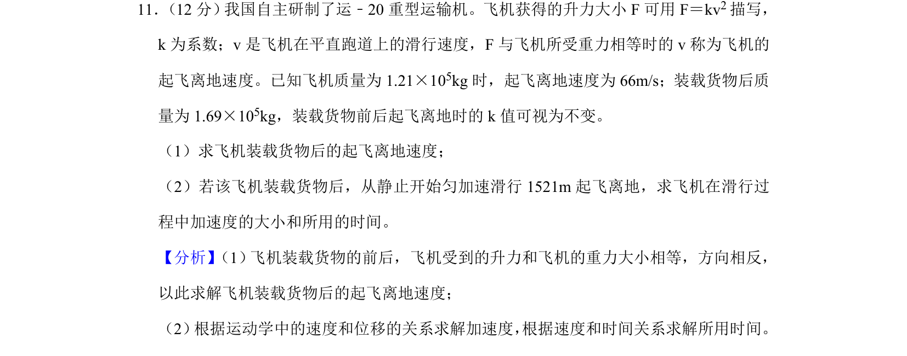
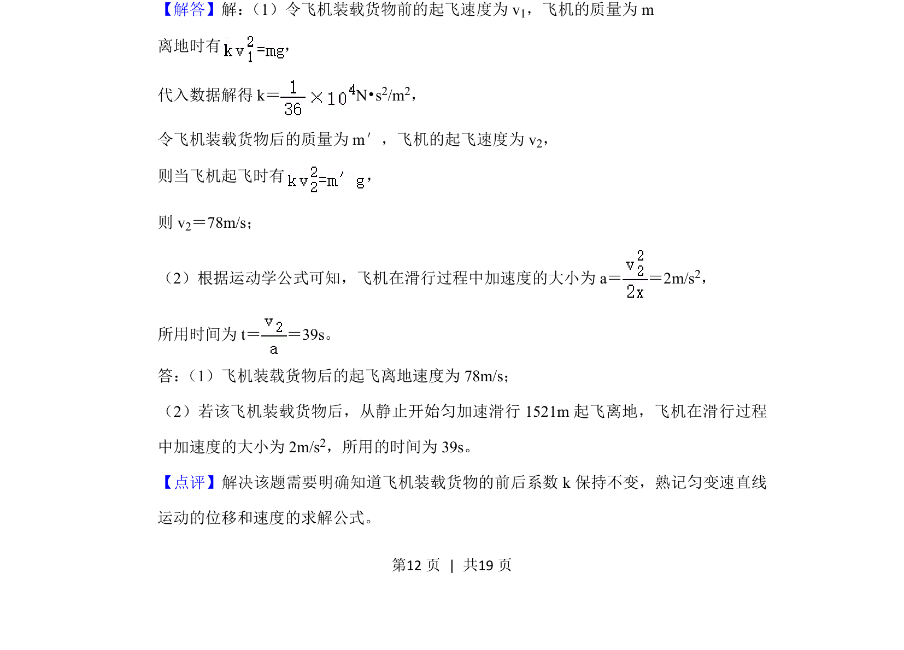

## 题面

## 摘要

飞机升力与重力平衡求起飞速度，结合匀变速直线运动公式求加速度和时间。

## 关联考点

- [[208-共点力平衡|共点力平衡]]
- [[795-匀变速直线运动规律|匀变速直线运动规律]]
- [[229-牛顿第二定律|牛顿第二定律]]

## 答案与解析

> 📄 原 PDF 第 12 页：`素材/真题/湖南/2008-2024·（湖南）物理高考真题/2020年高考物理试卷（新课标Ⅰ）（解析卷）.pdf`

<!-- 题干文本-start -->
## 题干文本
11． （12分） 我国自主研制了运﹣20重型运输机。飞机获得的升力大小F可用F＝kv2描写，
k为系数；v是飞机在平直跑道上的滑行速度，F与飞机所受重力相等时的v称为飞机的
起飞离地速度。已知飞机质量为1.21×10 5kg时，起飞离地速度为66m/s；装载货物后质
量为1.69×10 5kg，装载货物前后起飞离地时的k值可视为不变。
（1）求飞机装载货物后的起飞离地速度；
（2）若该飞机装载货物后，从静止开始匀加速滑行1521m起飞离地，求飞机在滑行过
程中加速度的大小和所用的时间。
<!-- 题干文本-end -->

<!-- 解析文本-start -->
## 解析文本
【分析】 （1） 飞机装载货物的前后，飞机受到的升力和飞机的重力大小相等，方向相反，
以此求解飞机装载货物后的起飞离地速度；
（2） 根据运动学中的速度和位移的关系求解加速度， 根据速度和时间关系求解所用时间。
【解答】解： （1）令飞机装载货物前的起飞速度为v1，飞机的质量为m
离地时有 ，
代入数据解得k＝N•s 2/m2，
令飞机装载货物后的质量为m′，飞机的起飞速度为v 2，
则当飞机起飞时有 ，
则v 2＝78m/s；
（2）根据运动学公式可知，飞机在滑行过程中加速度的大小为a＝ ＝2m/s 2，
所用时间为t＝ ＝39s。
答： （1）飞机装载货物后的起飞离地速度为78m/s；
（2）若该飞机装载货物后，从静止开始匀加速滑行1521m起飞离地，飞机在滑行过程
中加速度的大小为2m/s 2，所用的时间为39s。
【点评】解决该题需要明确知道飞机装载货物的前后系数k保持不变，熟记匀变速直线
运动的位移和速度的求解公式。
<!-- 解析文本-end -->
