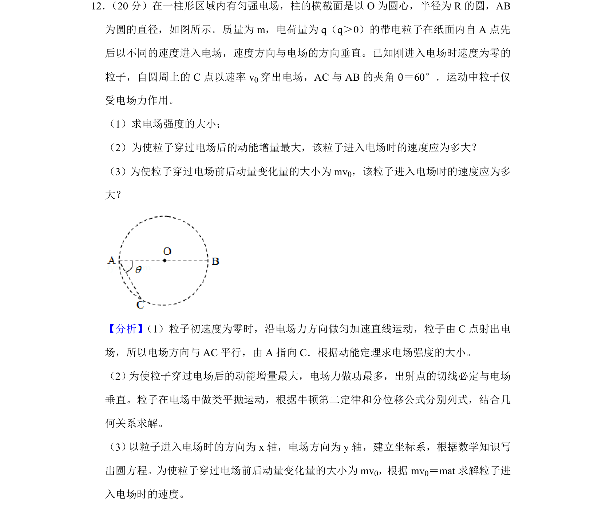
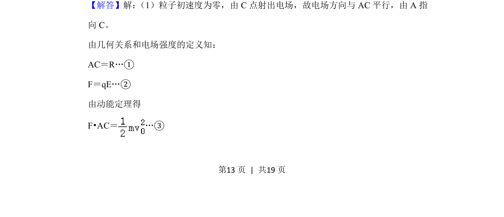
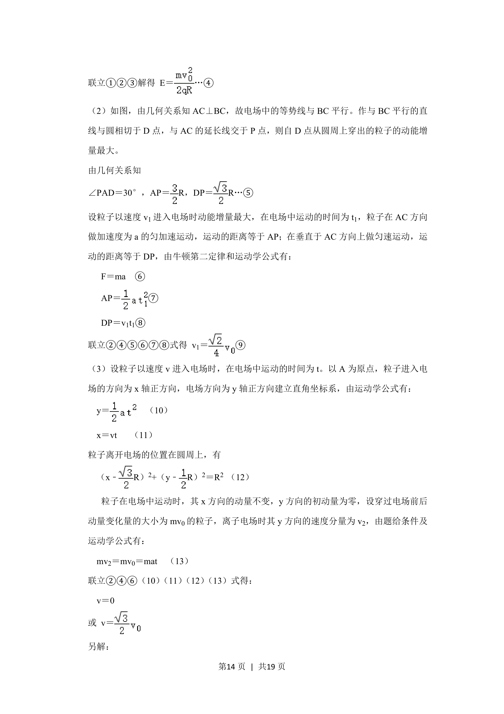
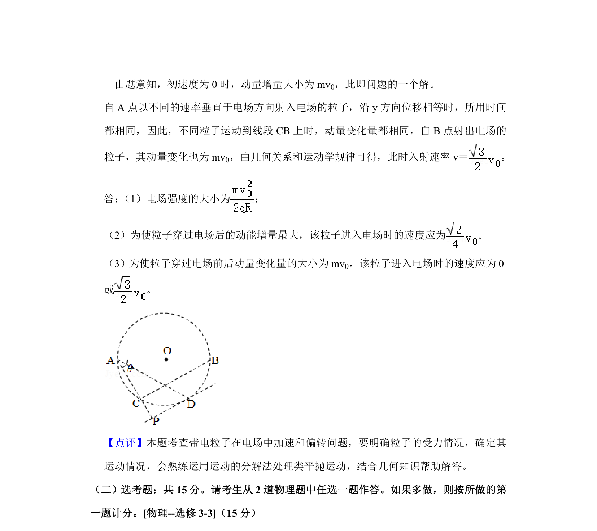

## 题面

## 摘要

带电粒子在匀强电场中的偏转，结合动能定理与动量定理求解电场强度及不同条件下的入射速度。

## 关联考点

- [[252-匀强电场|匀强电场]]
- [[488-类平抛运动|类平抛运动]]
- [[251-动能定理|动能定理]]
- [[349-动量定理|动量定理]]

## 答案与解析

> 📄 原 PDF 第 13 页：`素材/真题/湖南/2008-2024·（湖南）物理高考真题/2020年高考物理试卷（新课标Ⅰ）（解析卷）.pdf`

<!-- 题干文本-start -->
## 题干文本
12． （20分）在一柱形区域内有匀强电场，柱的横截面是以O为圆心，半径为R的圆，AB
为圆的直径，如图所示。质量为m，电荷量为q（q＞0）的带电粒子在纸面内自A点先
后以不同的速度进入电场，速度方向与电场的方向垂直。已知刚进入电场时速度为零的
粒子，自圆周上的C点以速率v 0穿出电场，AC与AB的夹角θ＝60°．运动中粒子仅
受电场力作用。
（1）求电场强度的大小；
（2）为使粒子穿过电场后的动能增量最大，该粒子进入电场时的速度应为多大？
（3）为使粒子穿过电场前后动量变化量的大小为mv0，该粒子进入电场时的速度应为多
大？
<!-- 题干文本-end -->

<!-- 解析文本-start -->
## 解析文本
【分析】 （1）粒子初速度为零时，沿电场力方向做匀加速直线运动，粒子由C点射出电
场，所以电场方向与AC平行，由A指向C．根据动能定理求电场强度的大小。
（2） 为使粒子穿过电场后的动能增量最大，电场力做功最多，出射点的切线必定与电场
垂直。粒子在电场中做类平抛运动，根据牛顿第二定律和分位移公式分别列式，结合几
何关系求解。
（3） 以粒子进入电场时的方向为x轴，电场方向为y轴，建立坐标系，根据数学知识写
出圆方程。为使粒子穿过电场前后动量变化量的大小为mv0，根据mv0＝mat求解粒子进
入电场时的速度。
【解答】解： （1）粒子初速度为零，由C点射出电场，故电场方向与AC平行，由A指
向C。
由几何关系和电场强度的定义知：
AC＝R…①
F＝qE…②
由动能定理得
F•AC＝…③
<!-- 解析文本-end -->
