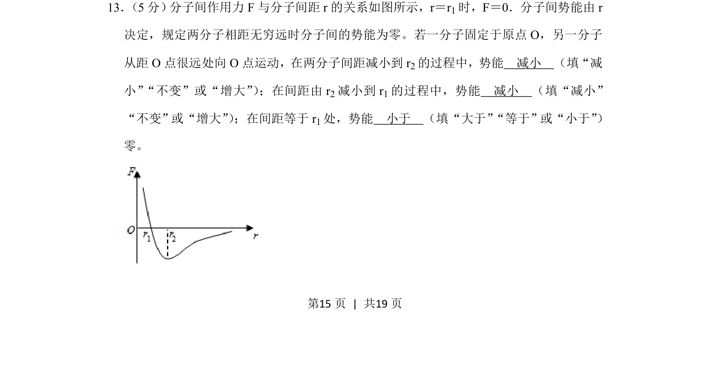
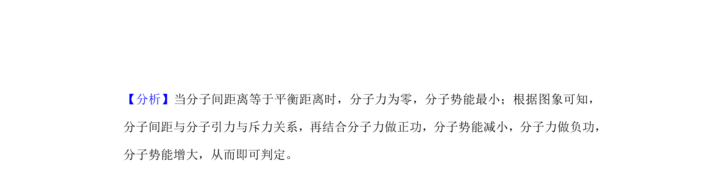
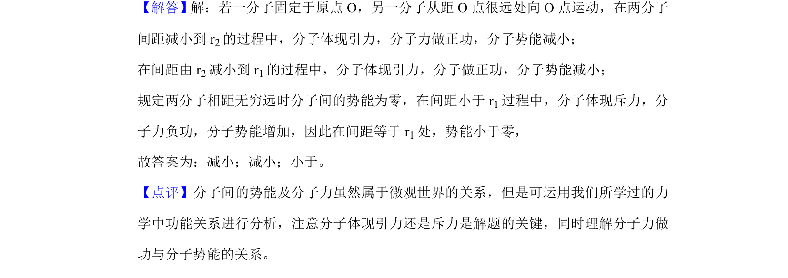

## 题面

## 摘要

分子间作用力与分子势能随间距变化的关系，根据F-r图像判断势能增减及r1处势能正负。

## 关联考点

- [[423-分子间作用力|分子间作用力]]
- [[分子势能]]
- [[F-r图像]]

## 答案与解析

> 📄 原 PDF 第 15 页：`素材/真题/湖南/2008-2024·（湖南）物理高考真题/2020年高考物理试卷（新课标Ⅰ）（解析卷）.pdf`
