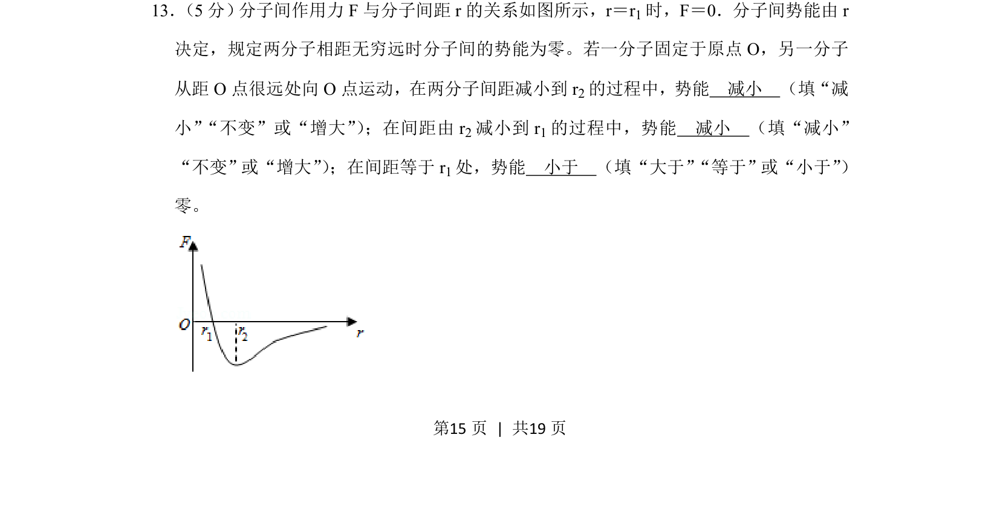
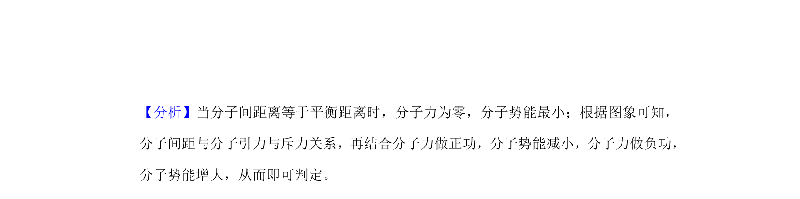
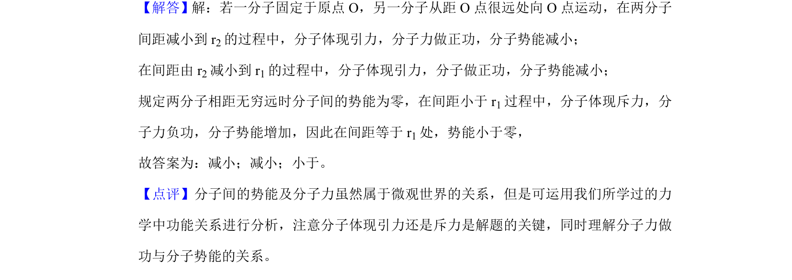

## 题面

## 摘要

分子间作用力与分子势能随间距变化的关系，根据F-r图像判断势能增减及r1处势能正负。

## 关联考点

- [[423-分子间作用力|分子间作用力]]
- [[867-分子势能|分子势能]]
- [[F-r图像]]

## 答案与解析

> 📄 原 PDF 第 15 页：`素材/真题/湖南/2008-2024·（湖南）物理高考真题/2020年高考物理试卷（新课标Ⅰ）（解析卷）.pdf`

<!-- 题干文本-start -->
## 题干文本
13． （5分） 分子间作用力F与分子间距r的关系如图所示，r＝r1时，F＝0．分子间势能由r
决定，规定两分子相距无穷远时分子间的势能为零。若一分子固定于原点O，另一分子
从距O点很远处向O点运动，在两分子间距减小到r 2的过程中，势能　减小　（填“减
小” “不变”或“增大”） ；在间距由r2减小到r 1的过程中，势能　减小　（填“减小”
“不变”或“增大”） ；在间距等于r1处，势能　小于　（填“大于” “等于”或“小于”）
零。
<!-- 题干文本-end -->

<!-- 解析文本-start -->
## 解析文本

<!-- 解析文本-end -->
