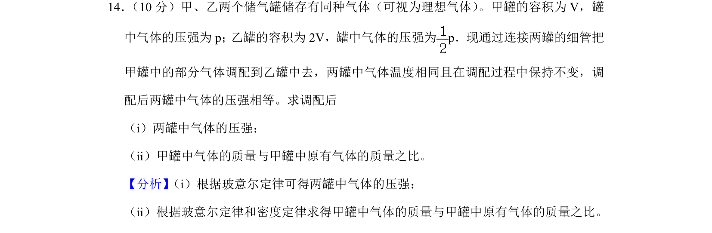
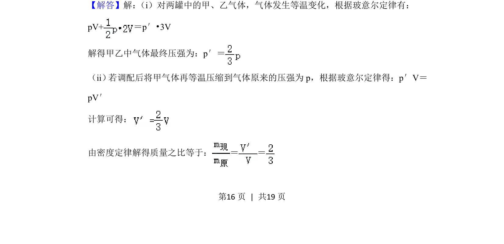
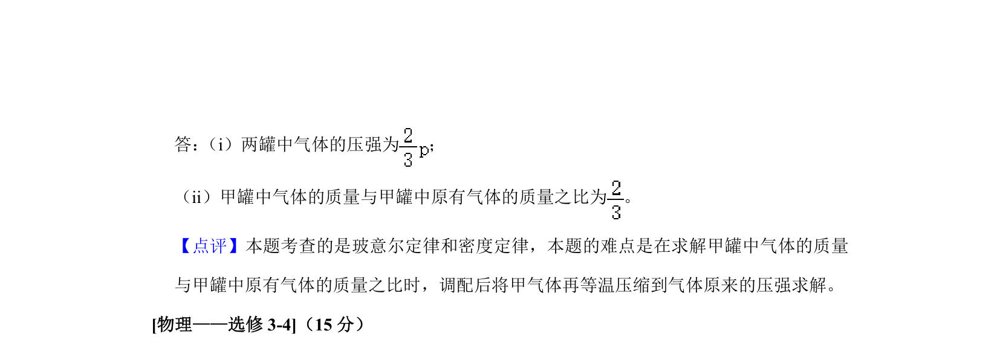

## 题面

## 摘要

气体等温调配问题，利用玻意耳定律求混合后压强及质量比。

## 关联考点

- [[445-理想气体|理想气体]]
- [[444-玻意耳定律|玻意耳定律]]
- [[444-玻意耳定律|等温变化]]

## 答案与解析

> 📄 原 PDF 第 16 页：`素材/真题/湖南/2008-2024·（湖南）物理高考真题/2020年高考物理试卷（新课标Ⅰ）（解析卷）.pdf`
