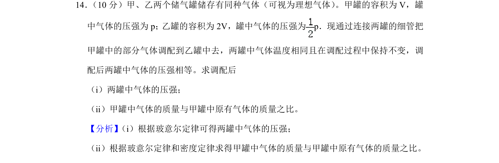
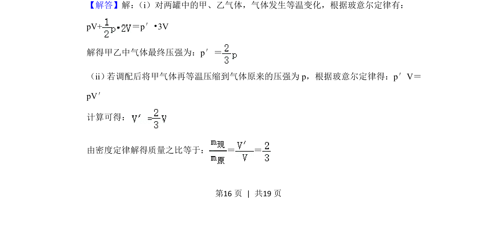
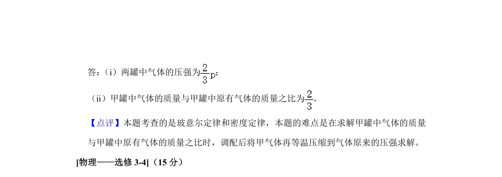

## 题面

## 摘要

气体等温调配问题，利用玻意耳定律求混合后压强及质量比。

## 关联考点

- [[445-理想气体|理想气体]]
- [[444-玻意耳定律|玻意耳定律]]
- [[444-玻意耳定律|等温变化]]

## 答案与解析

> 📄 原 PDF 第 16 页：`素材/真题/湖南/2008-2024·（湖南）物理高考真题/2020年高考物理试卷（新课标Ⅰ）（解析卷）.pdf`

<!-- 题干文本-start -->
## 题干文本
14． （10分）甲、乙两个储气罐储存有同种气体（可视为理想气体） 。甲罐的容积为V，罐
中气体的压强为p； 乙罐的容积为2V，罐中气体的压强为p．现通过连接两罐的细管把
甲罐中的部分气体调配到乙罐中去，两罐中气体温度相同且在调配过程中保持不变，调
配后两罐中气体的压强相等。求调配后
（i）两罐中气体的压强；
（ii）甲罐中气体的质量与甲罐中原有气体的质量之比。
<!-- 题干文本-end -->

<!-- 解析文本-start -->
## 解析文本
【分析】 （i）根据玻意尔定律可得两罐中气体的压强；
（ii）根据玻意尔定律和密度定律求得甲罐中气体的质量与甲罐中原有气体的质量之比。
【解答】解： （i）对两罐中的甲、乙气体，气体发生等温变化，根据玻意尔定律有：
pV+＝p′•3V
解得甲乙中气体最终压强为：p′＝
（ii） 若调配后将甲气体再等温压缩到气体原来的压强为p，根据玻意尔定律得：p′V＝
pV′
计算可得：
由密度定律解得质量之比等于： ＝ ＝
<!-- 解析文本-end -->
