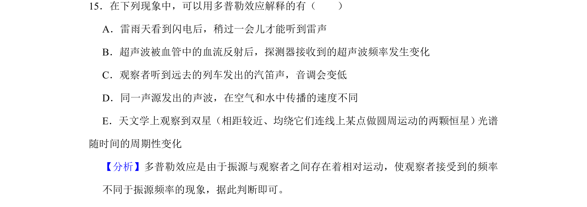
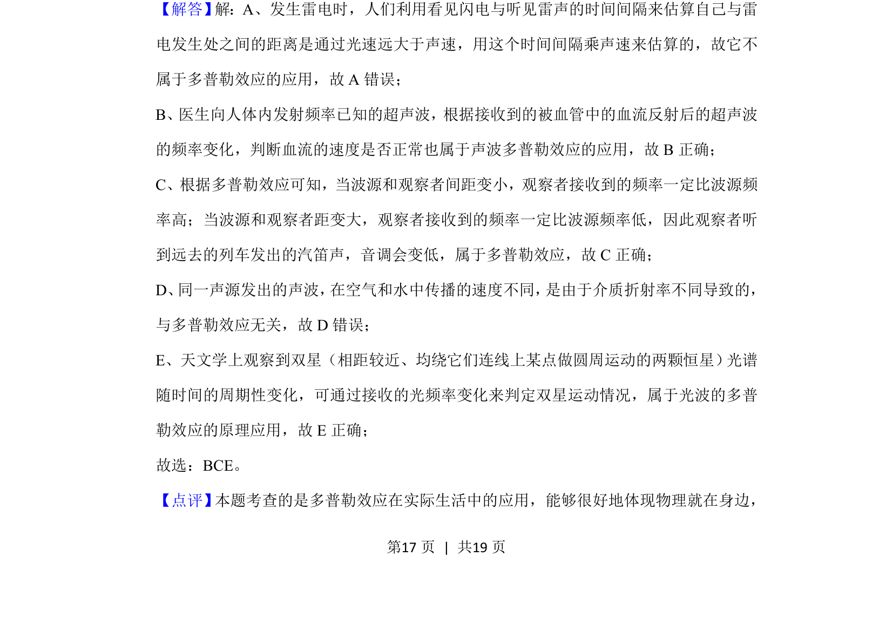

## 题面

## 摘要

本题通过生活与科技实例辨析多普勒效应的适用条件。

## 关联考点

- [[357-多普勒效应|多普勒效应]]
- [[波的频率变化]]
- [[波源与观察者相对运动]]

## 答案与解析

> 📄 原 PDF 第 17 页：`素材/真题/湖南/2008-2024·（湖南）物理高考真题/2020年高考物理试卷（新课标Ⅰ）（解析卷）.pdf`

<!-- 题干文本-start -->
## 题干文本
15．在下列现象中，可以用多普勒效应解释的有（　　）
A．雷雨天看到闪电后，稍过一会儿才能听到雷声
B．超声波被血管中的血流反射后，探测器接收到的超声波频率发生变化
C．观察者听到远去的列车发出的汽笛声，音调会变低
D．同一声源发出的声波，在空气和水中传播的速度不同
E．天文学上观察到双星（相距较近、均绕它们连线上某点做圆周运动的两颗恒星） 光谱
随时间的周期性变化
<!-- 题干文本-end -->

<!-- 解析文本-start -->
## 解析文本
【分析】多普勒效应是由于振源与观察者之间存在着相对运动，使观察者接受到的频率
不同于振源频率的现象，据此判断即可。
【解答】 解：A、发生雷电时，人们利用看见闪电与听见雷声的时间间隔来估算自己与雷
电发生处之间的距离是通过光速远大于声速，用这个时间间隔乘声速来估算的，故它不
属于多普勒效应的应用，故A错误；
B、医生向人体内发射频率已知的超声波，根据接收到的被血管中的血流反射后的超声波
的频率变化，判断血流的速度是否正常也属于声波多普勒效应的应用，故B正确；
C、根据多普勒效应可知，当波源和观察者间距变小，观察者接收到的频率一定比波源频
率高；当波源和观察者距变大，观察者接收到的频率一定比波源频率低，因此观察者听
到远去的列车发出的汽笛声，音调会变低，属于多普勒效应，故C正确；
D、 同一声源发出的声波， 在空气和水中传播的速度不同， 是由于介质折射率不同导致的，
与多普勒效应无关，故D错误；
E、天文学上观察到双星（相距较近、均绕它们连线上某点做圆周运动的两颗恒星） 光谱
随时间的周期性变化，可通过接收的光频率变化来判定双星运动情况，属于光波的多普
勒效应的原理应用，故E正确；
故选：BCE。
【点评】 本题考查的是多普勒效应在实际生活中的应用，能够很好地体现物理就在身边，
<!-- 解析文本-end -->
