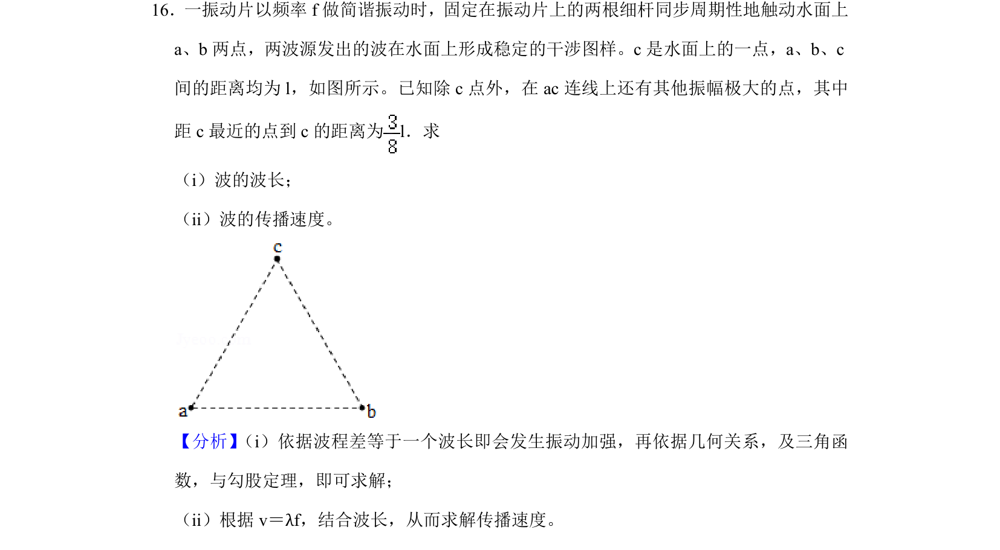
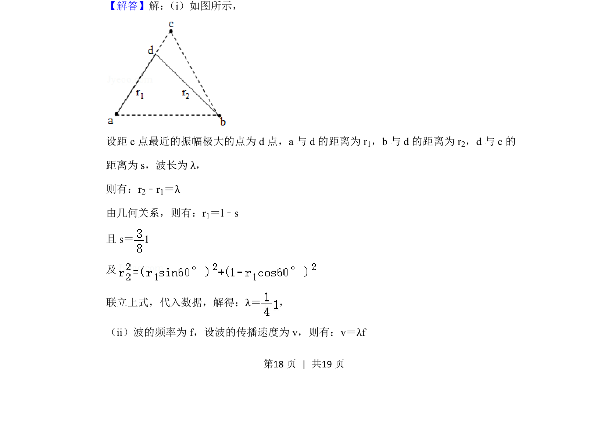
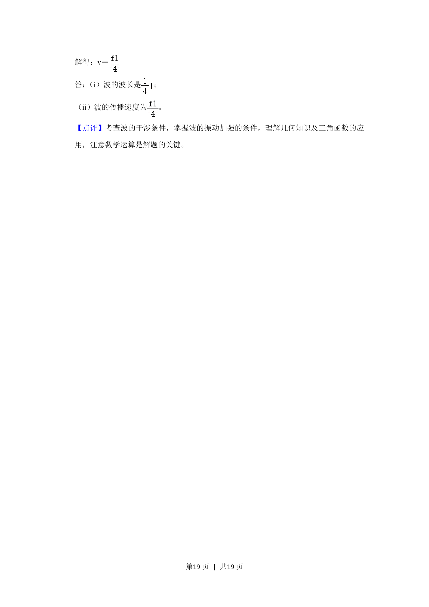

## 题面

## 摘要

考查波的干涉加强条件及波长、波速的计算，涉及几何关系分析。

## 关联考点

- [[366-波的干涉|波的干涉]]
- [[振动加强条件]]
- [[370-波长|波长]]
- [[858-波速公式|波速公式]]

## 答案与解析

> 📄 原 PDF 第 18 页：`素材/真题/湖南/2008-2024·（湖南）物理高考真题/2020年高考物理试卷（新课标Ⅰ）（解析卷）.pdf`
