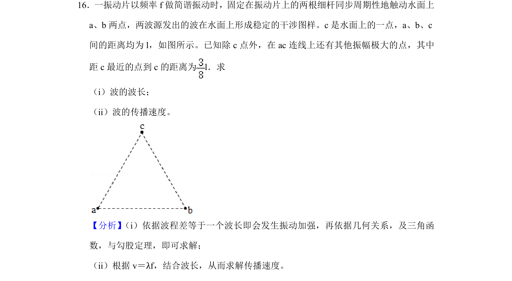
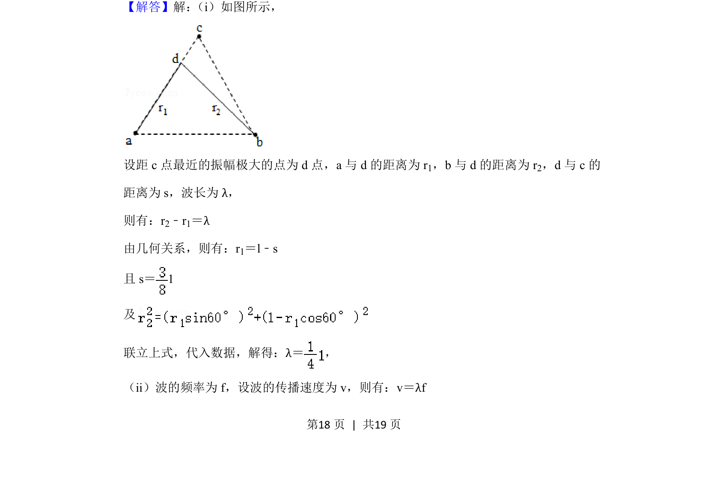
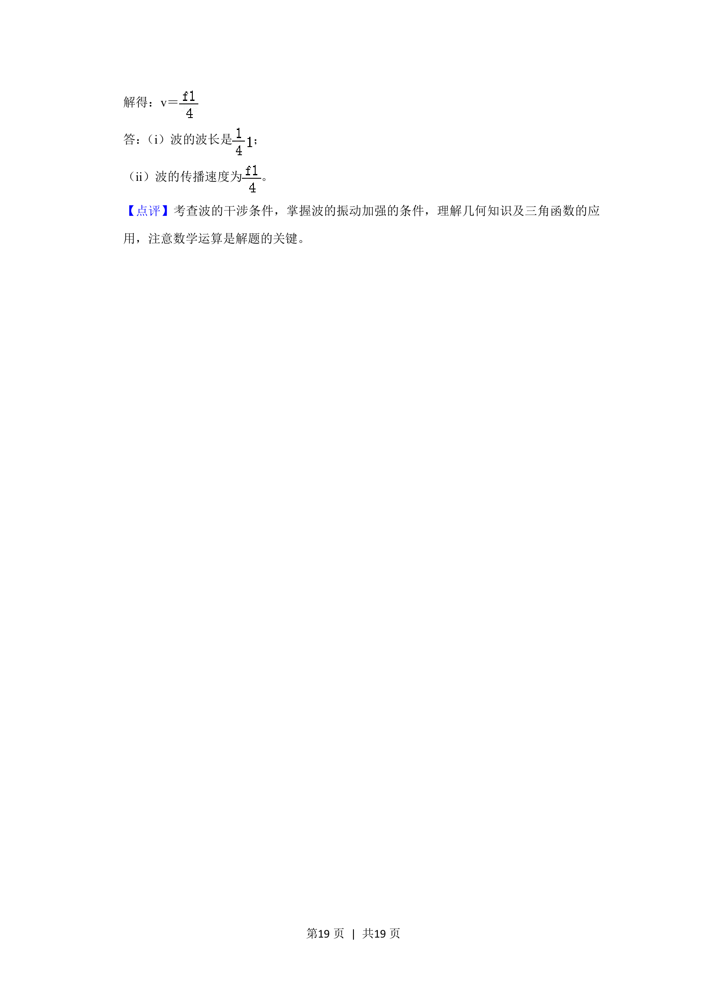

## 题面

## 摘要

考查波的干涉加强条件及波长、波速的计算，涉及几何关系分析。

## 关联考点

- [[366-波的干涉|波的干涉]]
- [[振动加强条件]]
- [[370-波长|波长]]
- [[858-波速公式|波速公式]]

## 答案与解析

> 📄 原 PDF 第 18 页：`素材/真题/湖南/2008-2024·（湖南）物理高考真题/2020年高考物理试卷（新课标Ⅰ）（解析卷）.pdf`

<!-- 题干文本-start -->
## 题干文本
16．一振动片以频率f做简谐振动时，固定在振动片上的两根细杆同步周期性地触动水面上
a、b两点，两波源发出的波在水面上形成稳定的干涉图样。c是水面上的一点，a、b、c
间的距离均为l，如图所示。已知除c点外，在ac连线上还有其他振幅极大的点，其中
距c最近的点到c的距离为l．求
（i）波的波长；
（ii）波的传播速度。
<!-- 题干文本-end -->

<!-- 解析文本-start -->
## 解析文本
【分析】 （i）依据波程差等于一个波长即会发生振动加强，再依据几何关系，及三角函
数，与勾股定理，即可求解；
（ii）根据v＝λf，结合波长，从而求解传播速度。
【解答】解： （i）如图所示，
设距c点最近的振幅极大的点为d点，a与d的距离为r 1，b与d的距离为r 2，d与c的
距离为s，波长为λ，
则有：r2﹣r1＝λ
由几何关系，则有：r1＝l﹣s
且s＝1
及
联立上式，代入数据，解得：λ＝ ，
（ii）波的频率为f，设波的传播速度为v，则有：v＝λf
<!-- 解析文本-end -->
