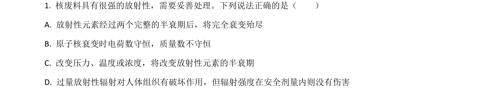
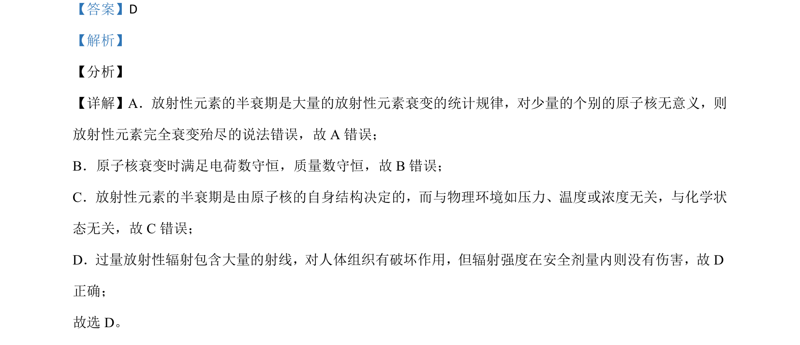

## 题面

## 摘要

该题考查放射性元素半衰期的统计规律、衰变守恒定律、半衰期影响因素及辐射危害。

## 关联考点

- [[424-半衰期|半衰期]]
- [[衰变守恒]]
- [[半衰期影响因素]]
- [[辐射危害]]

## 答案与解析

> 📄 原 PDF 第 1 页：`素材/真题/湖南/2008-2024·（湖南）物理高考真题/2021年高考物理试卷（湖南）（解析卷）.pdf`
