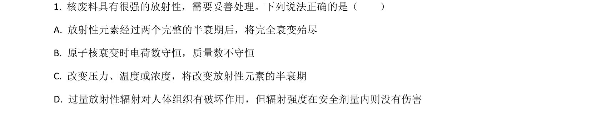
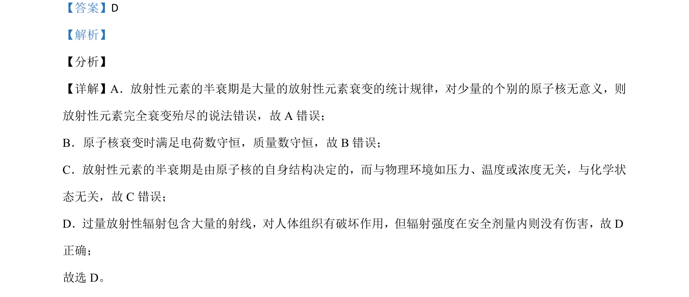

## 题面

## 摘要

该题考查放射性元素半衰期的统计规律、衰变守恒定律、半衰期影响因素及辐射危害。

## 关联考点

- [[424-半衰期|半衰期]]
- [[衰变守恒]]
- [[半衰期影响因素]]
- [[辐射危害]]

## 答案与解析

> 📄 原 PDF 第 1 页：`素材/真题/湖南/2008-2024·（湖南）物理高考真题/2021年高考物理试卷（湖南）（解析卷）.pdf`

<!-- 题干文本-start -->
## 题干文本
1. 核废料具有很强的放射性，需要妥善处理。下列说法正确的是（　　）
A. 放射性元素经过两个完整的半衰期后，将完全衰变殆尽
B. 原子核衰变时电荷数守恒，质量数不守恒
C. 改变压力、温度或浓度，将改变放射性元素的半衰期
D. 过量放射性辐射对人体组织有破坏作用，但辐射强度在安全剂量内则没有伤害
<!-- 题干文本-end -->

<!-- 解析文本-start -->
## 解析文本
【答案】D
【解析】
【分析】
【详解】A．放射性元素的半衰期是大量的放射性元素衰变的统计规律，对少量的个别的原子核无意义，则
放射性元素完全衰变殆尽的说法错误，故 A 错误；
B．原子核衰变时满足电荷数守恒，质量数守恒，故 B错误；
C．放射性元素的半衰期是由原子核的自身结构决定的，而与物理环境如压力、温度或浓度无关，与化学状
态无关，故 C错误；
D．过量放射性辐射包含大量的射线，对人体组织有破坏作用，但辐射强度在安全剂量内则没有伤害，故D
正确；
故选 D。
<!-- 解析文本-end -->
