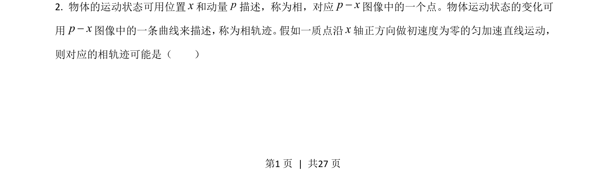
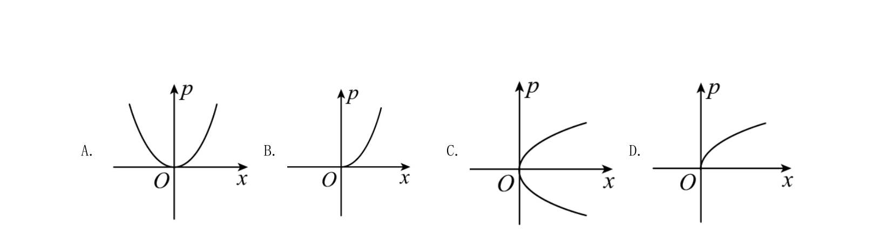
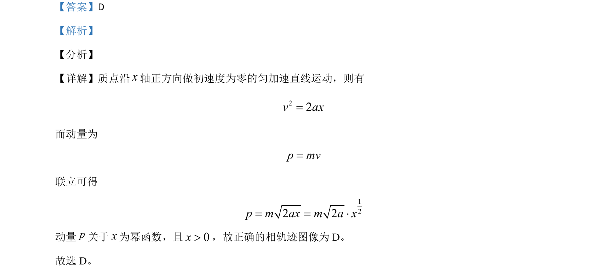

## 题面

## 摘要

质点做初速为零的匀加速直线运动，推导动量与位移的幂函数关系并选择相轨迹图像

## 关联考点

- [[215-匀变速直线运动|匀变速直线运动]]
- [[346-动量|动量]]
- [[492-运动图像|运动图像]]

## 答案与解析

> 📄 原 PDF 第 1 页：`素材/真题/湖南/2008-2024·（湖南）物理高考真题/2021年高考物理试卷（湖南）（解析卷）.pdf`
