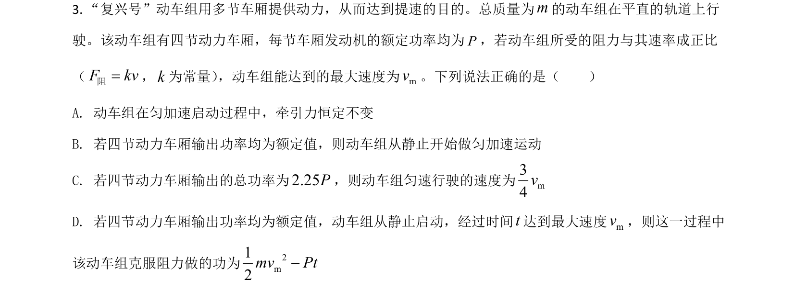
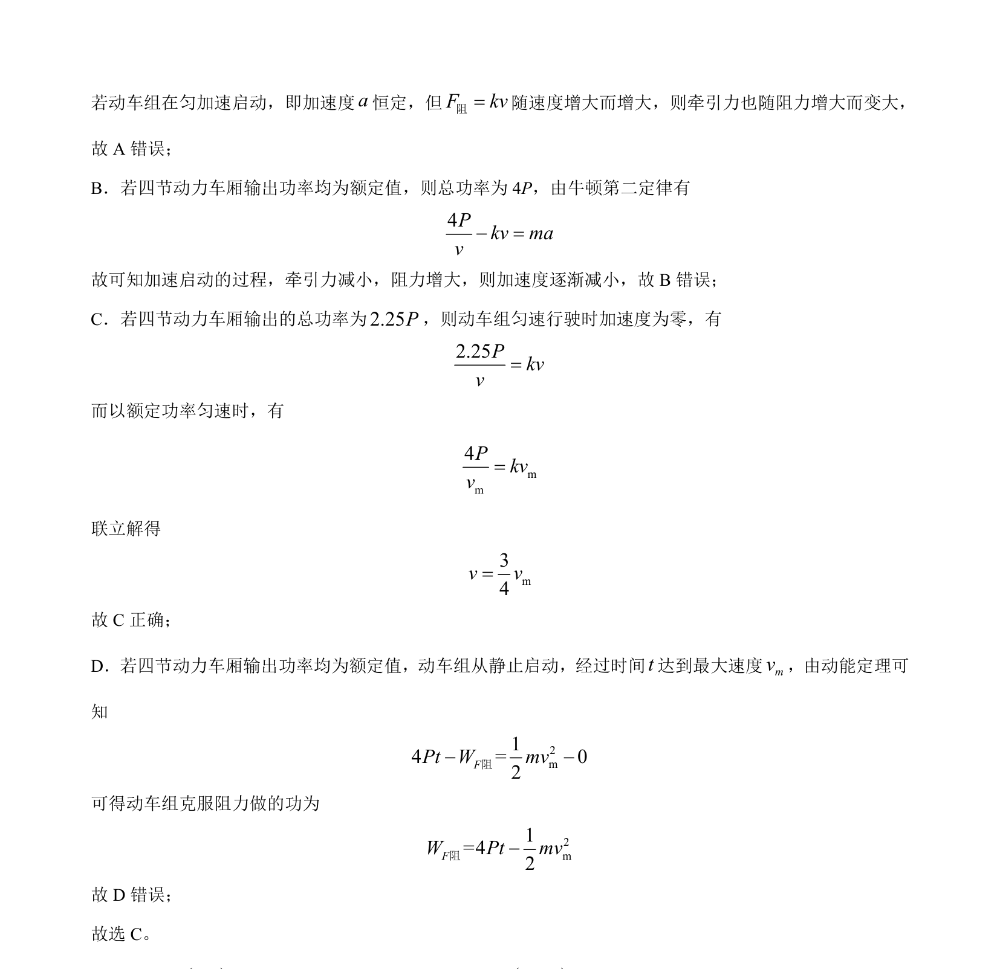

## 题面

## 摘要

动车组以恒定功率启动，分析阻力随速度变化时加速度与速度的关系，结合牛顿第二定律和动能定理求解。

## 关联考点

- [[229-牛顿第二定律|牛顿第二定律]]
- [[功率与牵引力]]
- [[251-动能定理|动能定理]]
- [[变加速运动]]

## 答案与解析

> 📄 原 PDF 第 2 页：`素材/真题/湖南/2008-2024·（湖南）物理高考真题/2021年高考物理试卷（湖南）（解析卷）.pdf`
