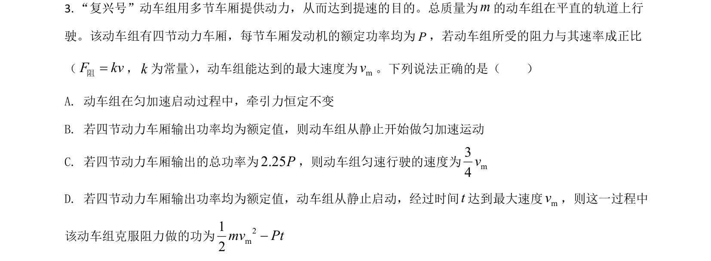
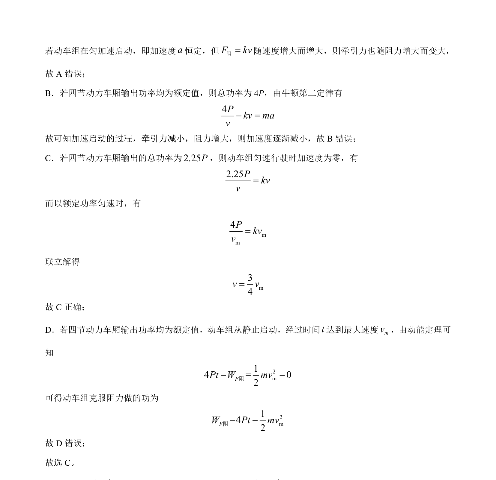

## 题面

## 摘要

动车组以恒定功率启动，分析阻力随速度变化时加速度与速度的关系，结合牛顿第二定律和动能定理求解。

## 关联考点

- [[229-牛顿第二定律|牛顿第二定律]]
- [[功率与牵引力]]
- [[251-动能定理|动能定理]]
- [[变加速运动]]

## 答案与解析

> 📄 原 PDF 第 2 页：`素材/真题/湖南/2008-2024·（湖南）物理高考真题/2021年高考物理试卷（湖南）（解析卷）.pdf`

<!-- 题干文本-start -->
## 题干文本
3. “复兴号”动车组用多节车厢提供动力，从而达到提速的目的。总质量为m的动车组在平直的轨道上行
驶。该动车组有四节动力车厢，每节车厢发动机的额定功率均为P，若动车组所受的阻力与其速率成正比
（F kv=阻，k为常量） ，动车组能达到的最大速度为mv。下列说法正确的是（　　）
A. 动车组在匀加速启动过程中，牵引力恒定不变
B. 若四节动力车厢输出功率均为额定值，则动车组从静止开始做匀加速运动
C. 若四节动力车厢输出的总功率为2.25P，则动车组匀速行驶的速度为m34v
D. 若四节动力车厢输出功率均为额定值，动车组从静止启动，经过时间t达到最大速度mv，则这一过程中
该动车组克服阻力做的功为 2m12mv Pt-
<!-- 题干文本-end -->

<!-- 解析文本-start -->
## 解析文本
【答案】C
【解析】
【分析】
【详解】A．对动车由牛顿第二定律有
=F F ma-阻
<!-- 解析文本-end -->
