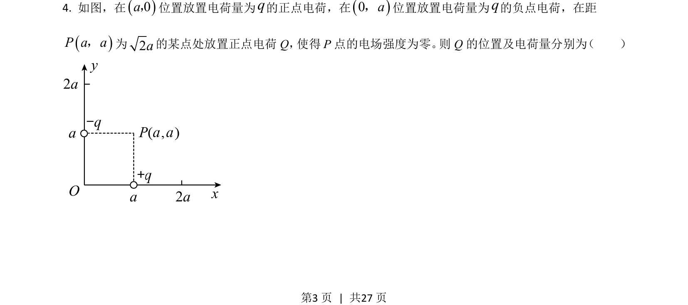
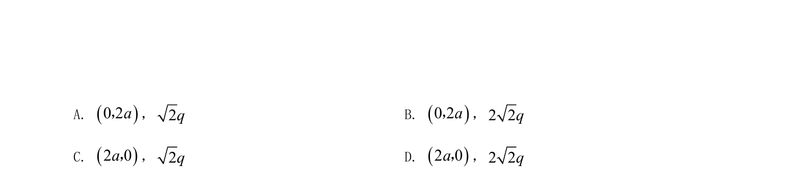
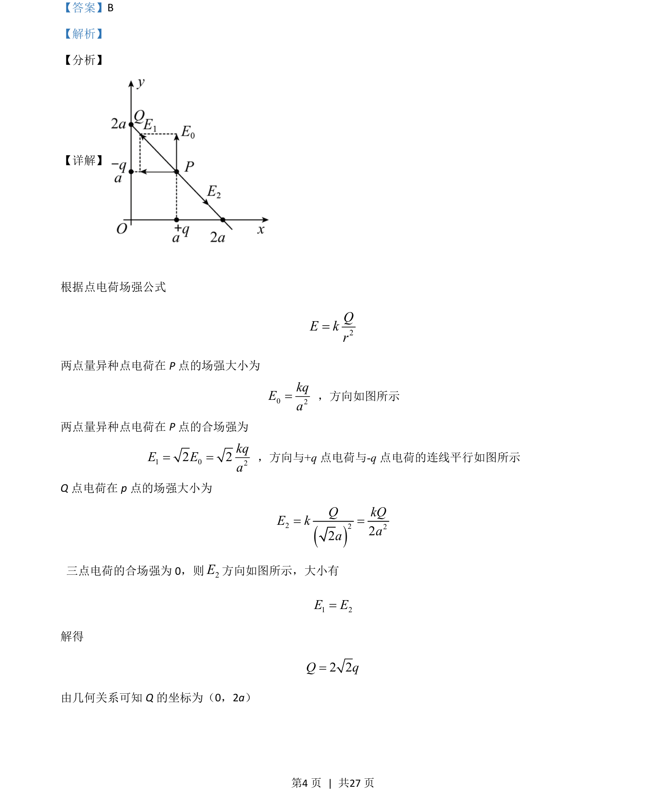

## 题面

## 摘要

考查点电荷电场强度叠加，利用P点合场强为零求解电荷量及坐标。

## 关联考点

- [[点电荷场强公式]]
- [[674-电场强度叠加|电场强度叠加]]
- [[456-几何关系|几何关系]]

## 答案与解析

> 📄 原 PDF 第 3 页：`素材/真题/湖南/2008-2024·（湖南）物理高考真题/2021年高考物理试卷（湖南）（解析卷）.pdf`
