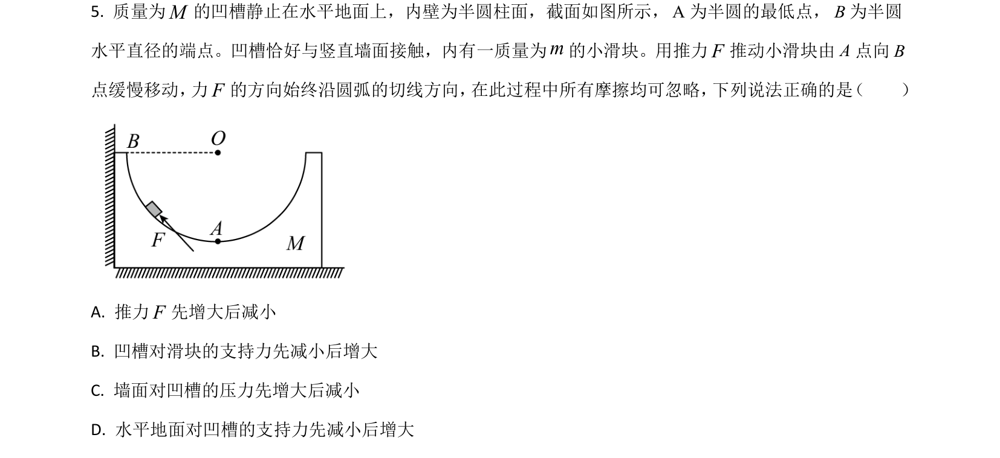
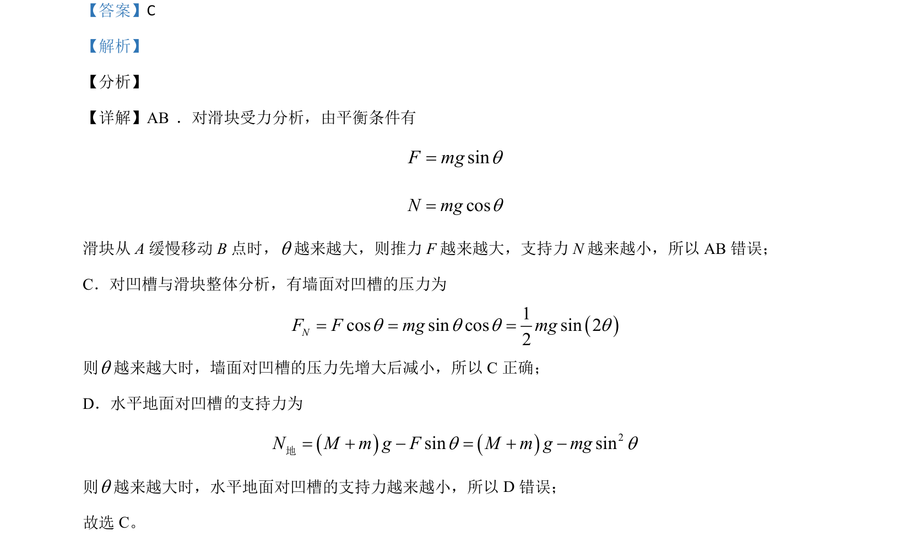

## 题面

## 摘要

滑块在斜面上缓慢移动，通过平衡条件分析推力、支持力变化，并用整体法判断墙面和地面受力。

## 关联考点

- [[208-共点力平衡|共点力平衡]]
- [[474-整体法与隔离法|整体法与隔离法]]
- [[536-动态平衡分析|动态平衡分析]]

## 答案与解析

> 📄 原 PDF 第 5 页：`素材/真题/湖南/2008-2024·（湖南）物理高考真题/2021年高考物理试卷（湖南）（解析卷）.pdf`
