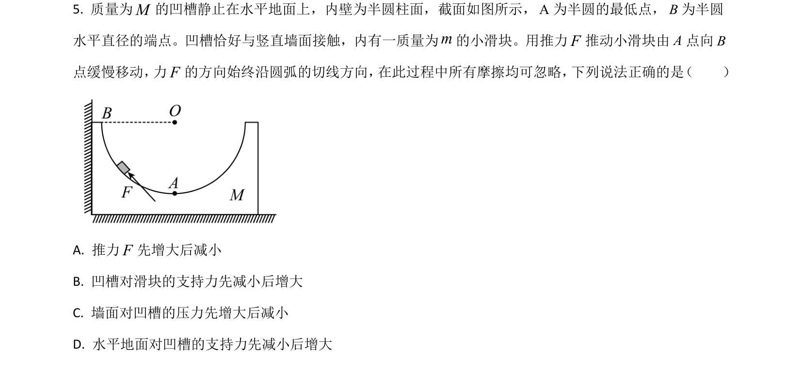
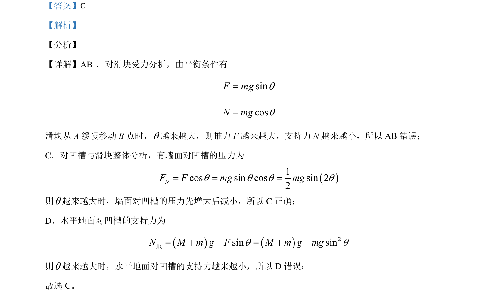

## 题面

## 摘要

滑块在斜面上缓慢移动，通过平衡条件分析推力、支持力变化，并用整体法判断墙面和地面受力。

## 关联考点

- [[208-共点力平衡|共点力平衡]]
- [[474-整体法与隔离法|整体法与隔离法]]
- [[536-动态平衡分析|动态平衡分析]]

## 答案与解析

> 📄 原 PDF 第 5 页：`素材/真题/湖南/2008-2024·（湖南）物理高考真题/2021年高考物理试卷（湖南）（解析卷）.pdf`

<!-- 题干文本-start -->
## 题干文本
5. 质量为M的凹槽静止在水平地面上，内壁为半圆柱面，截面如图所示，A为半圆的最低点，B为半圆
水平直径的端点。凹槽恰好与竖直墙面接触，内有一质量为m的小滑块。用推力F推动小滑块由 A点向B
点缓慢移动， 力F的方向始终沿圆弧的切线方向， 在此过程中所有摩擦均可忽略， 下列说法正确的是 （　　）
A. 推力F先增大后减小
B. 凹槽对滑块的支持力先减小后增大
C. 墙面对凹槽的压力先增大后减小
D. 水平地面对凹槽的支持力先减小后增大
<!-- 题干文本-end -->

<!-- 解析文本-start -->
## 解析文本
【答案】C
【解析】
【分析】
【详解】AB ．对滑块受力分析，由平衡条件有
sinF mgq=cosN mgq=
滑块从 A缓慢移动 B点时，q越来越大，则推力 F越来越大，支持力 N越来越小，所以 AB 错误；
C．对凹槽与滑块整体分析，有墙面对凹槽的压力为
1cos sin cos sin 22NF F mg mgq q q q= = =
则q越来越大时，墙面对凹槽的压力先增大后减小，所以 C正确；
D．水平地面对凹槽 支持力为
2sin sinN M m g F M m g mgq q= + - = + -地
则q越来越大时，水平地面对凹槽的支持力越来越小，所以 D 错误；
故选 C。
<!-- 解析文本-end -->
