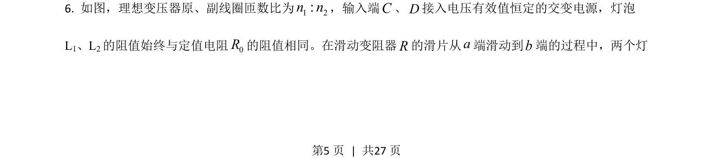
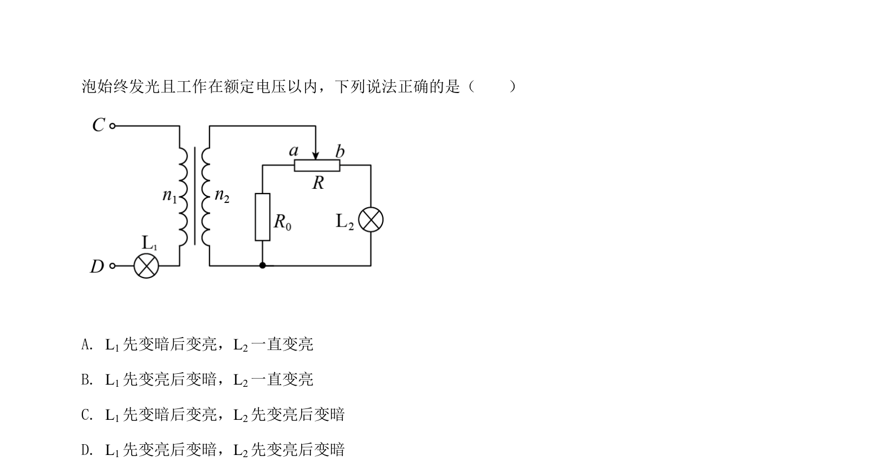
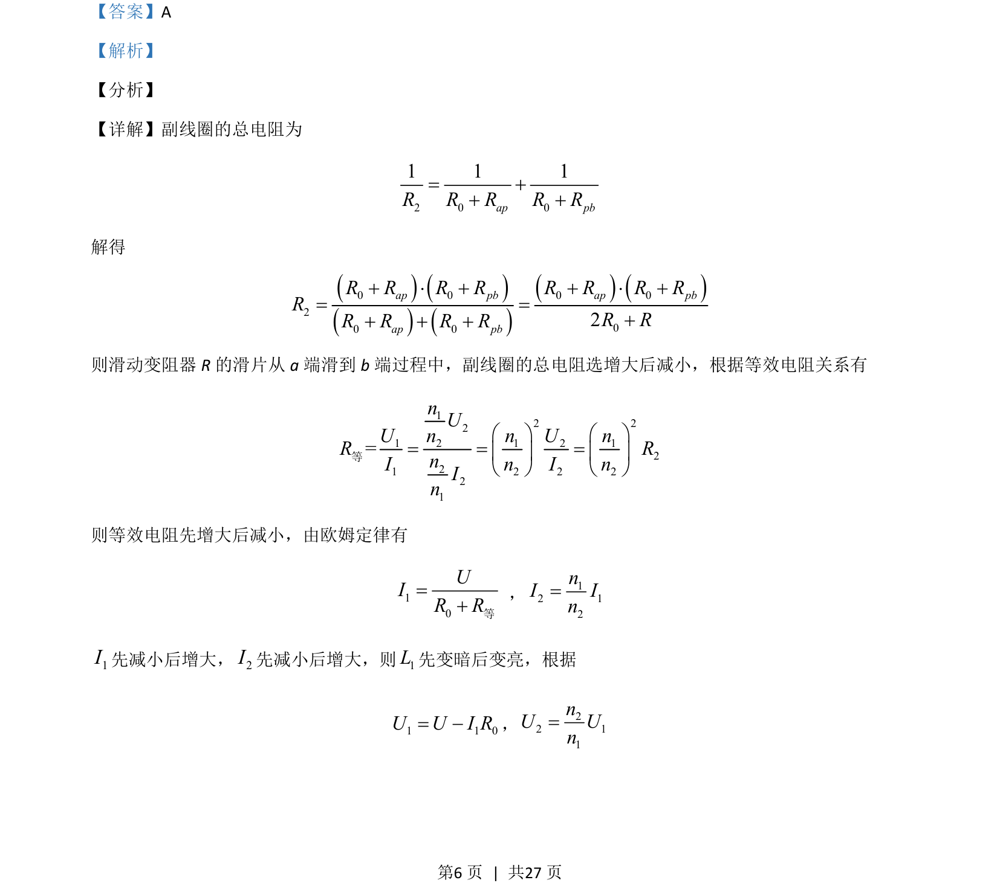
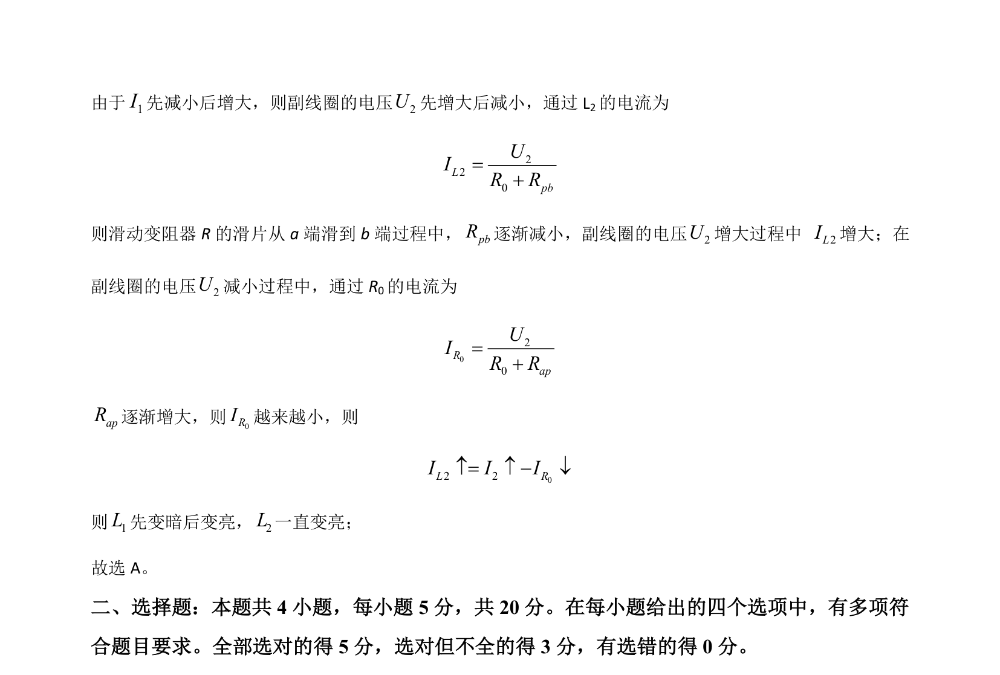

## 题面

## 摘要

考查理想变压器副线圈接有滑动变阻器的动态电路分析，结合等效电阻法判断灯泡亮度变化。

## 关联考点

- [[398-理想变压器|理想变压器]]
- [[等效电阻]]
- [[792-动态电路分析|动态电路分析]]
- [[141-欧姆定律-初中|欧姆定律]]

## 答案与解析

> 📄 原 PDF 第 5 页：`素材/真题/湖南/2008-2024·（湖南）物理高考真题/2021年高考物理试卷（湖南）（解析卷）.pdf`
