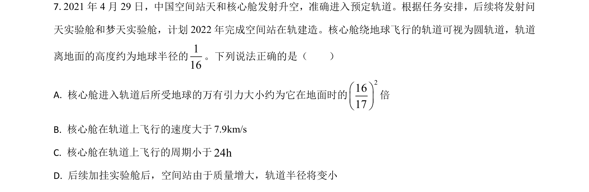
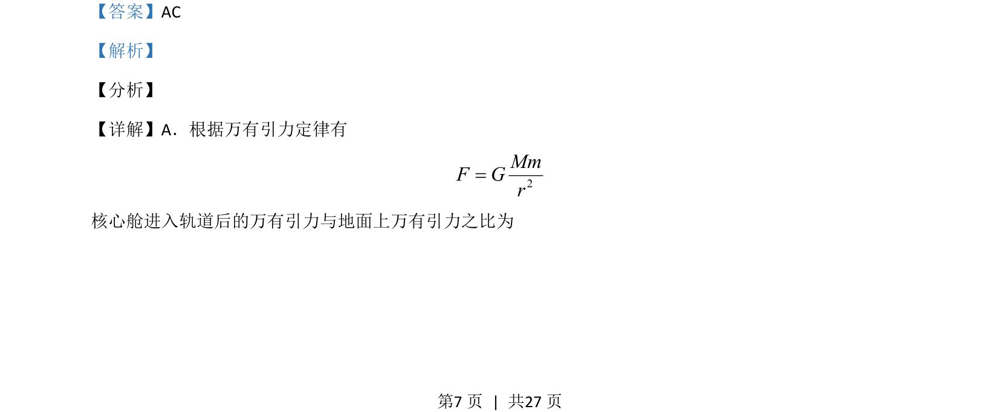
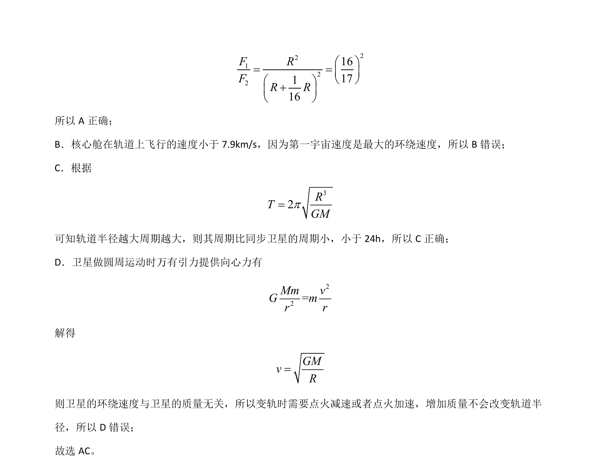

## 题面

## 摘要

本题通过核心舱轨道参数考查万有引力定律、环绕速度、周期比较及变轨原理。

## 关联考点

- [[246-万有引力定律|万有引力定律]]
- [[281-第一宇宙速度|第一宇宙速度]]
- [[卫星周期]]
- [[卫星变轨]]

## 答案与解析

> 📄 原 PDF 第 7 页：`素材/真题/湖南/2008-2024·（湖南）物理高考真题/2021年高考物理试卷（湖南）（解析卷）.pdf`
