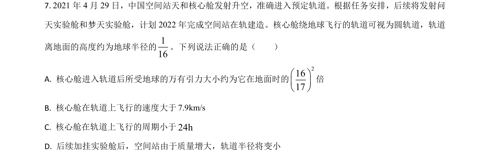
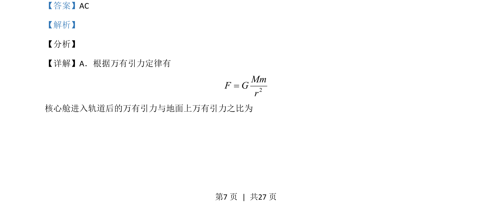
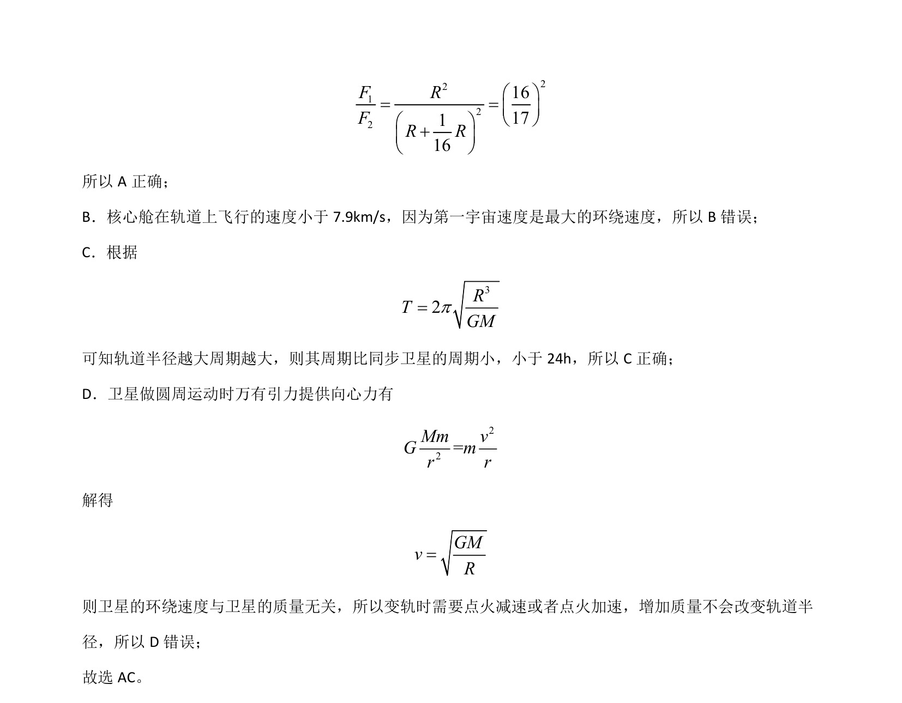

## 题面

## 摘要

本题通过核心舱轨道参数考查万有引力定律、环绕速度、周期比较及变轨原理。

## 关联考点

- [[246-万有引力定律|万有引力定律]]
- [[281-第一宇宙速度|第一宇宙速度]]
- [[卫星周期]]
- [[卫星变轨]]

## 答案与解析

> 📄 原 PDF 第 7 页：`素材/真题/湖南/2008-2024·（湖南）物理高考真题/2021年高考物理试卷（湖南）（解析卷）.pdf`

<!-- 题干文本-start -->
## 题干文本
7. 2021 年 4 月 29 日，中国空间站天和核心舱发射升空，准确进入预定轨道。根据任务安排，后续将发射问
天实验舱和梦天实验舱，计划 2022 年完成空间站在轨建造。核心舱绕地球飞行的轨道可视为圆轨道，轨道
离地面的高度约为地球半径的116
。下列说法正确的是（　　）
A. 核心舱进入轨道后所受地球的万有引力大小约为它在地面时的
21617æ öç ÷è ø
倍
B. 核心舱在轨道上飞行的速度大于7.9km/s
C. 核心舱在轨道上飞行的周期小于24h
D. 后续加挂实验舱后，空间站由于质量增大，轨道半径将变小
<!-- 题干文本-end -->

<!-- 解析文本-start -->
## 解析文本
【答案】AC
【解析】
【分析】
【详解】A．根据万有引力定律有
2MmF Gr=
核心舱进入轨道后的万有引力与地面上万有引力之比为
<!-- 解析文本-end -->
