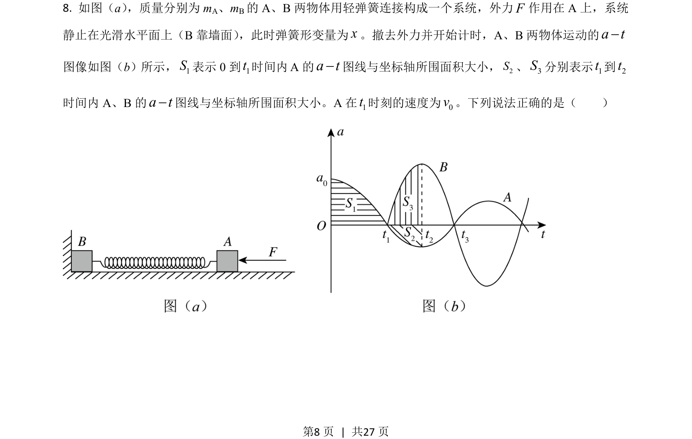
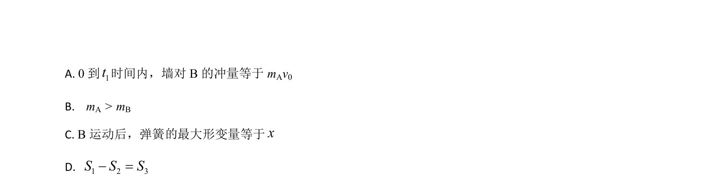
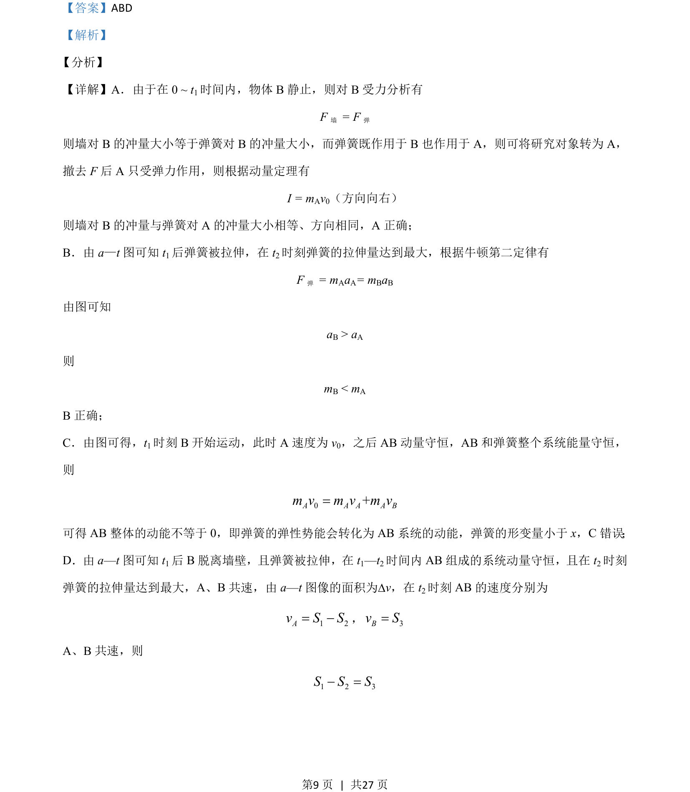
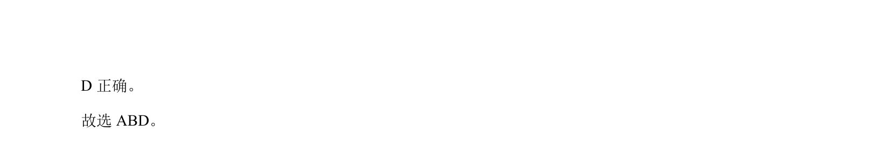

## 题面

## 摘要

含弹簧连接体的a-t图像分析，结合动量定理、动量守恒与能量转化判断选项正误

## 关联考点

- [[349-动量定理|动量定理]]
- [[539-动量守恒|动量守恒]]
- [[085-机械能守恒-初中|机械能守恒]]
- [[a-t图像]]

## 答案与解析

> 📄 原 PDF 第 8 页：`素材/真题/湖南/2008-2024·（湖南）物理高考真题/2021年高考物理试卷（湖南）（解析卷）.pdf`
