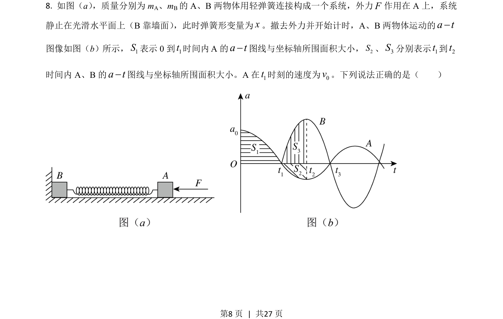
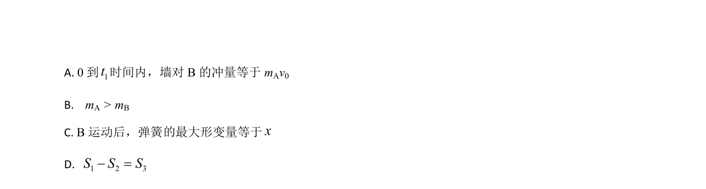
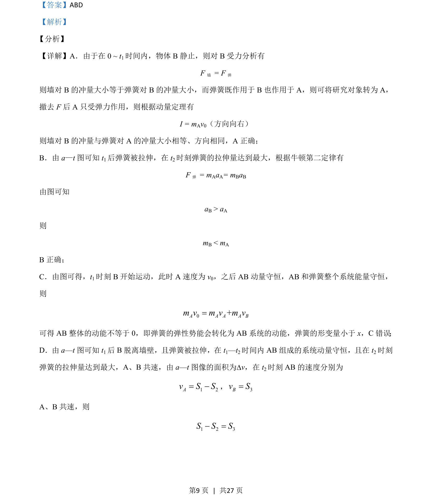
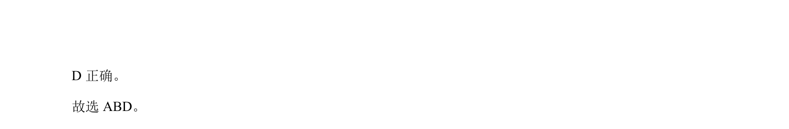

## 题面

## 摘要

含弹簧连接体的a-t图像分析，结合动量定理、动量守恒与能量转化判断选项正误

## 关联考点

- [[349-动量定理|动量定理]]
- [[539-动量守恒|动量守恒]]
- [[085-机械能守恒-初中|机械能守恒]]
- [[a-t图像]]

## 答案与解析

> 📄 原 PDF 第 8 页：`素材/真题/湖南/2008-2024·（湖南）物理高考真题/2021年高考物理试卷（湖南）（解析卷）.pdf`

<!-- 题干文本-start -->
## 题干文本
8. 如图（a） ，质量分别为mA、mB的 A、B两物体用轻弹簧连接构成一个系统，外力F作用在 A 上，系统
静止在光滑水平面上（B靠墙面） ，此时弹簧形变量为x。撤去外力并开始计时，A、B两物体运动的a t-
图像如图（b）所示，1S表示 0 到1t时间内A的a t-图线与坐标轴所围面积大小，2S、3S分别表示1t到2t
时间内 A、B的a t-图线与坐标轴所围面积大小。A 在1t时刻的速度为0v。下列说法正确的是（　　）
<!-- 题干文本-end -->

<!-- 解析文本-start -->
## 解析文本

<!-- 解析文本-end -->
