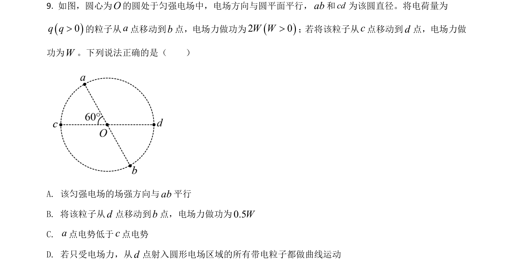
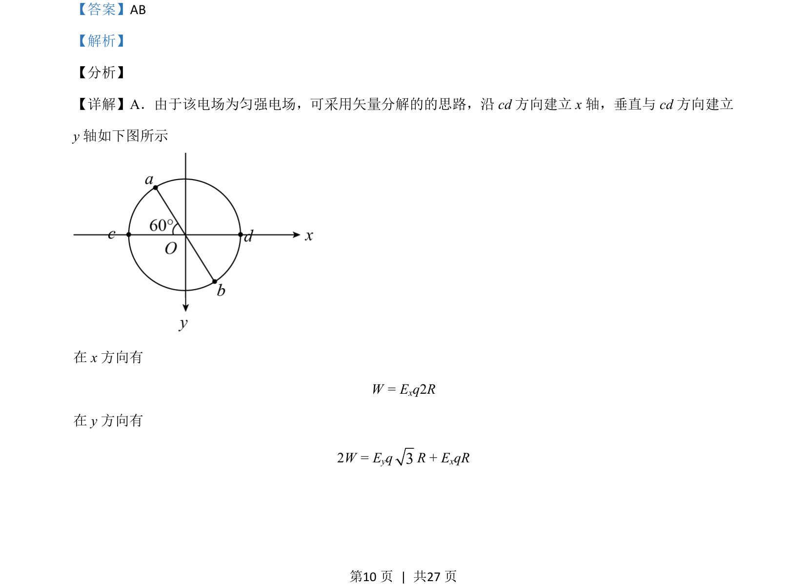
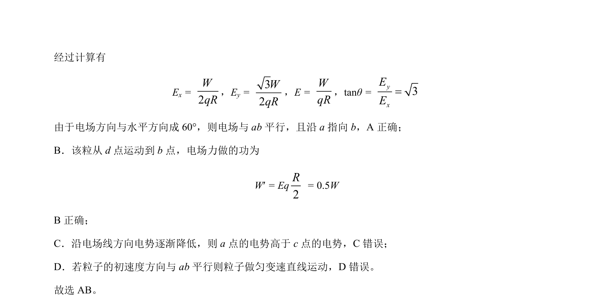

## 题面

## 摘要

匀强电场中利用矢量分解求解场强及电场力做功，判断电势与粒子运动。

## 关联考点

- [[252-匀强电场|匀强电场]]
- [[673-电场力做功|电场力做功]]
- [[矢量分解]]
- [[308-电势|电势]]

## 答案与解析

> 📄 原 PDF 第 10 页：`素材/真题/湖南/2008-2024·（湖南）物理高考真题/2021年高考物理试卷（湖南）（解析卷）.pdf`
