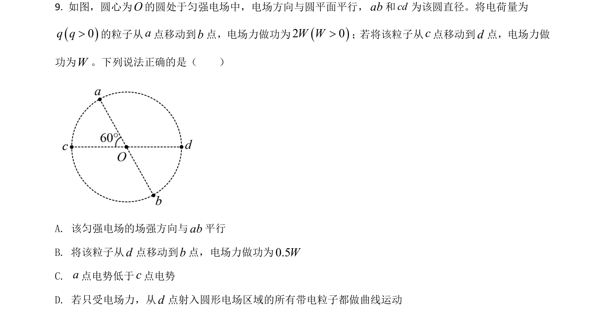
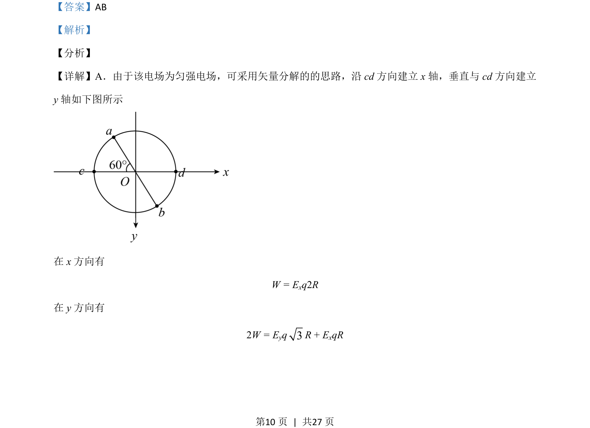
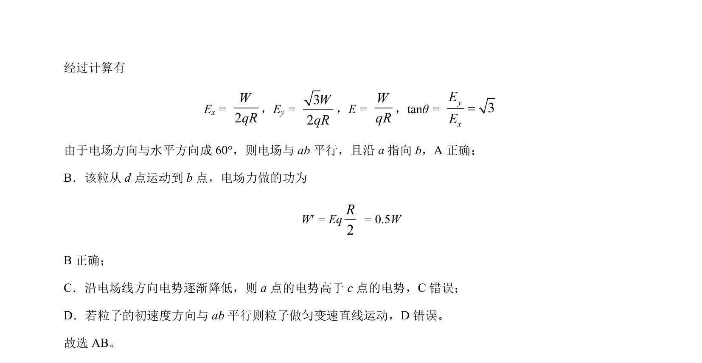

## 题面

## 摘要

匀强电场中利用矢量分解求解场强及电场力做功，判断电势与粒子运动。

## 关联考点

- [[252-匀强电场|匀强电场]]
- [[673-电场力做功|电场力做功]]
- [[矢量分解]]
- [[308-电势|电势]]

## 答案与解析

> 📄 原 PDF 第 10 页：`素材/真题/湖南/2008-2024·（湖南）物理高考真题/2021年高考物理试卷（湖南）（解析卷）.pdf`

<!-- 题干文本-start -->
## 题干文本
9. 如图，圆心为O的圆处于匀强电场中，电场方向与圆平面平行，ab和cd为该圆直径。将电荷量为
0q q>的粒子从a点移动到b点，电场力做功为2 0W W>； 若将该粒子从c点移动到d点，电场力做
功为W。下列说法正确的是（　　）
A. 该匀强电场的场强方向与ab平行
B. 将该粒子从d点移动到b点，电场力做功为0.5W
C. a点电势低于c点电势
D. 若只受电场力，从d点射入圆形电场区域的所有带电粒子都做曲线运动
<!-- 题干文本-end -->

<!-- 解析文本-start -->
## 解析文本
【答案】AB
【解析】
【分析】
【详解】A．由于该电场为匀强电场，可采用矢量分解的的思路，沿 cd方向建立 x轴，垂直与 cd方向建立
y轴如下图所示
在 x方向有
W = Exq2R
在 y方向有
2W = Eyq3R + ExqR
<!-- 解析文本-end -->
