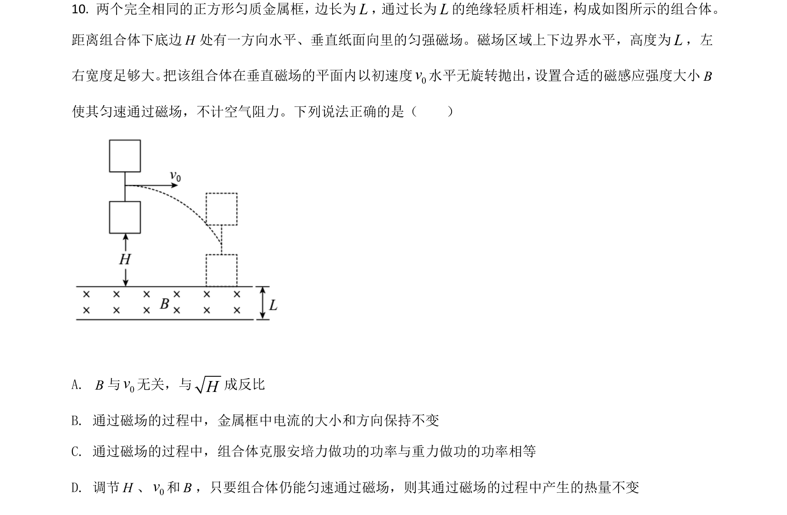
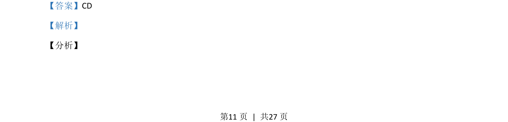
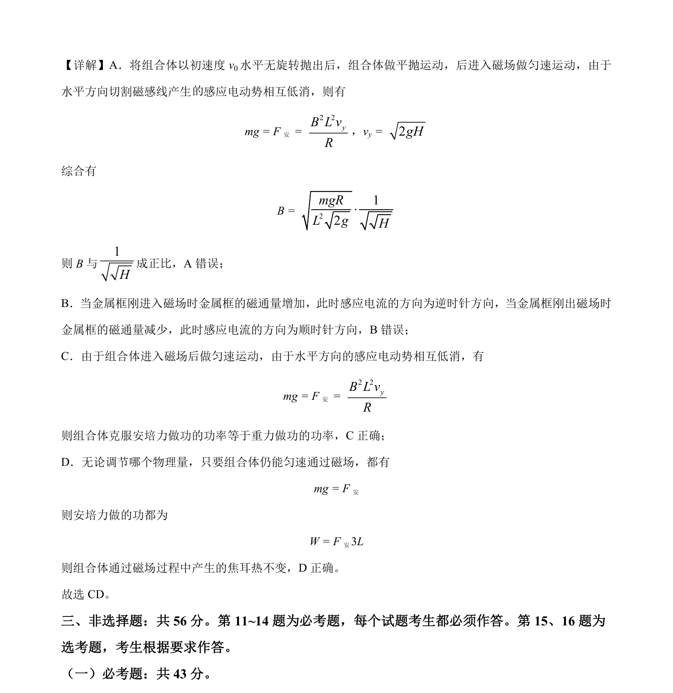

## 题面

## 摘要

组合体平抛后进入磁场匀速运动，考查安培力与重力平衡、感应电流方向及焦耳热计算。

## 关联考点

- [[261-平抛运动|平抛运动]]
- [[188-磁场对通电导体的作用|安培力]]
- [[387-感应电动势|感应电动势]]
- [[173-电热|焦耳热]]

## 答案与解析

> 📄 原 PDF 第 11 页：`素材/真题/湖南/2008-2024·（湖南）物理高考真题/2021年高考物理试卷（湖南）（解析卷）.pdf`
