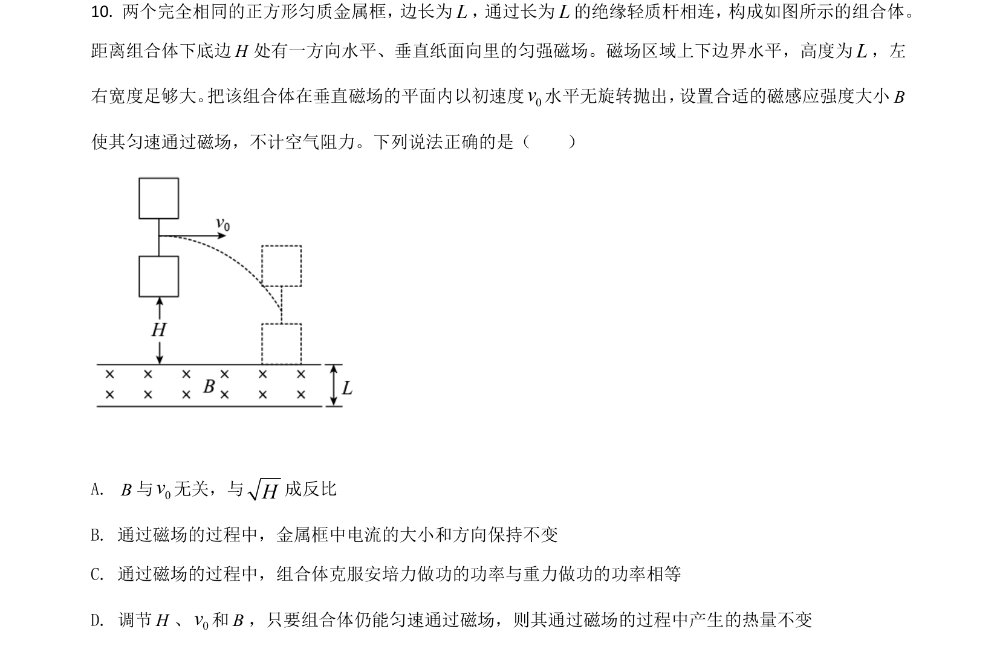
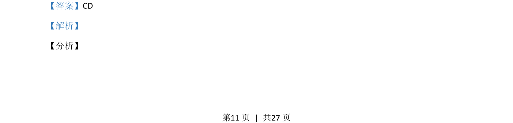
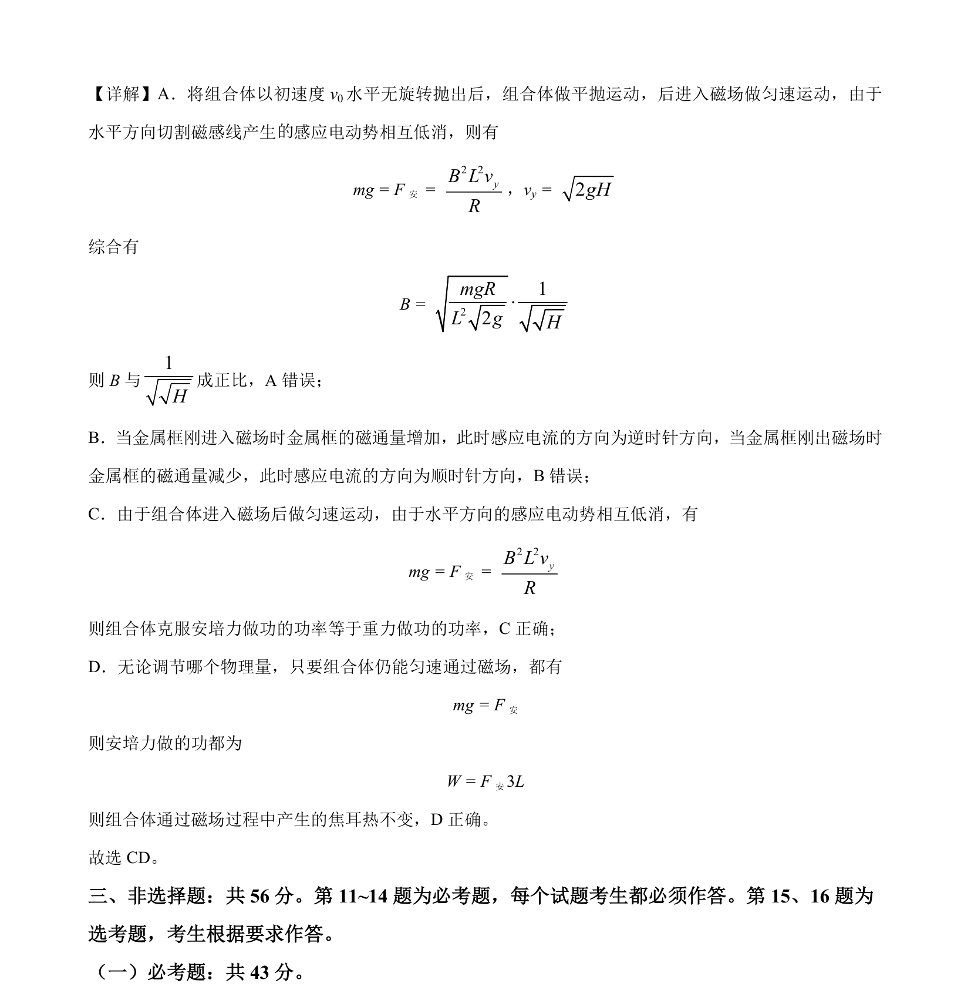

## 题面

## 摘要

组合体平抛后进入磁场匀速运动，考查安培力与重力平衡、感应电流方向及焦耳热计算。

## 关联考点

- [[261-平抛运动|平抛运动]]
- [[188-磁场对通电导体的作用|安培力]]
- [[387-感应电动势|感应电动势]]
- [[173-电热|焦耳热]]

## 答案与解析

> 📄 原 PDF 第 11 页：`素材/真题/湖南/2008-2024·（湖南）物理高考真题/2021年高考物理试卷（湖南）（解析卷）.pdf`

<!-- 题干文本-start -->
## 题干文本
10. 两个完全相同的正方形匀质金属框，边长为L， 通过长为L的绝缘轻质杆相连， 构成如图所示的组合体。
距离组合体下底边H处有一方向水平、垂直纸面向里的匀强磁场。磁场区域上下边界水平，高度为L，左
右宽度足够大。 把该组合体在垂直磁场的平面内以初速度0v水平无旋转抛出， 设置合适的磁感应强度大小B
使其匀速通过磁场，不计空气阻力。下列说法正确的是（　　）
A. B与0v无关，与H成反比
B. 通过磁场的过程中，金属框中电流的大小和方向保持不变
C. 通过磁场的过程中，组合体克服安培力做功的功率与重力做功的功率相等
D. 调节H、0v和B，只要组合体仍能匀速通过磁场，则其通过磁场的过程中产生的热量不变
<!-- 题干文本-end -->

<!-- 解析文本-start -->
## 解析文本
【答案】CD
【解析】
【分析】
<!-- 解析文本-end -->
