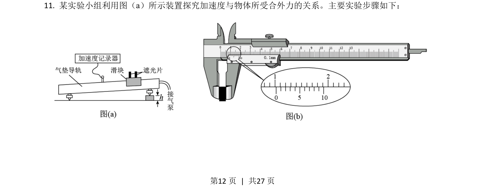
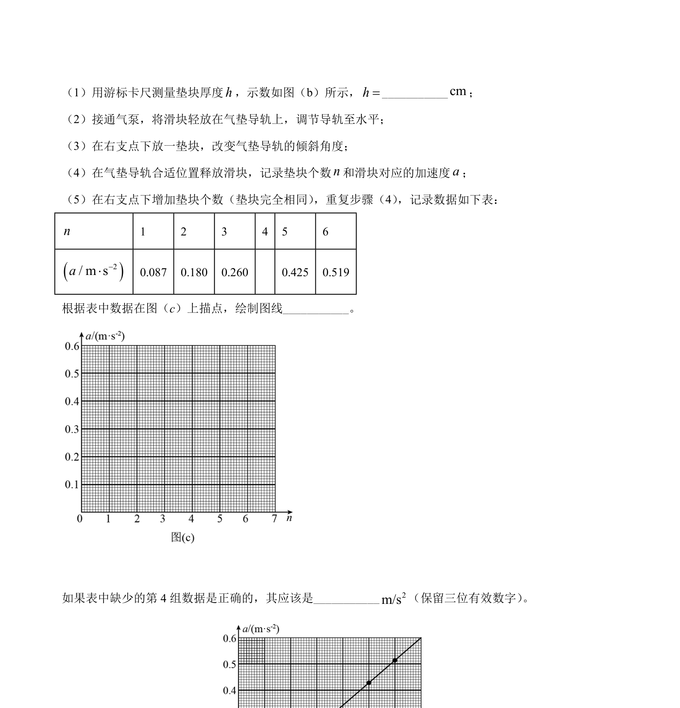
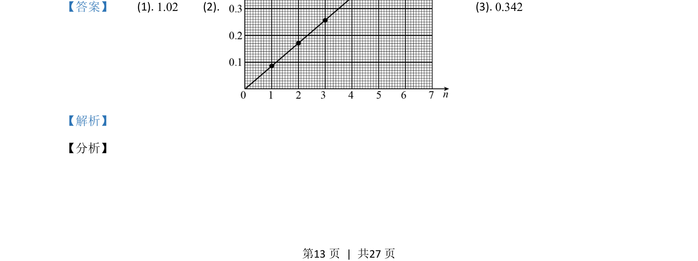
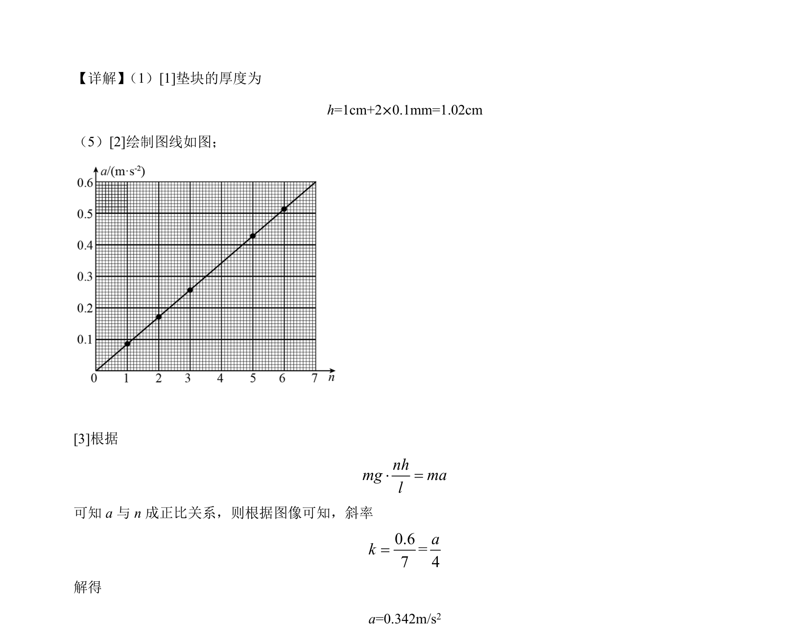

## 题面

## 摘要

该题考查用垫块和导轨测量加速度，涉及长度测量、图像法处理数据及牛顿第二定律的应用。

## 关联考点

- [[刻度尺读数]]
- [[图像法处理数据]]
- [[229-牛顿第二定律|牛顿第二定律]]

## 答案与解析

> 📄 原 PDF 第 12 页：`素材/真题/湖南/2008-2024·（湖南）物理高考真题/2021年高考物理试卷（湖南）（解析卷）.pdf`
