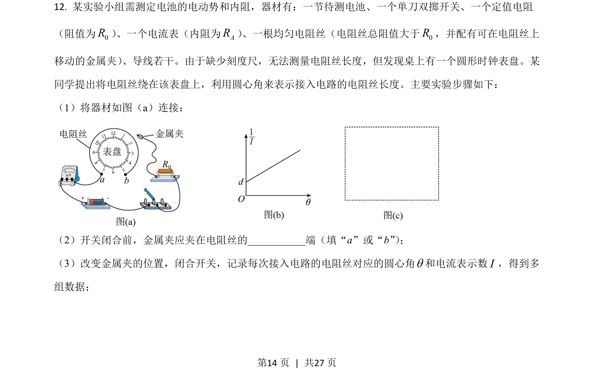
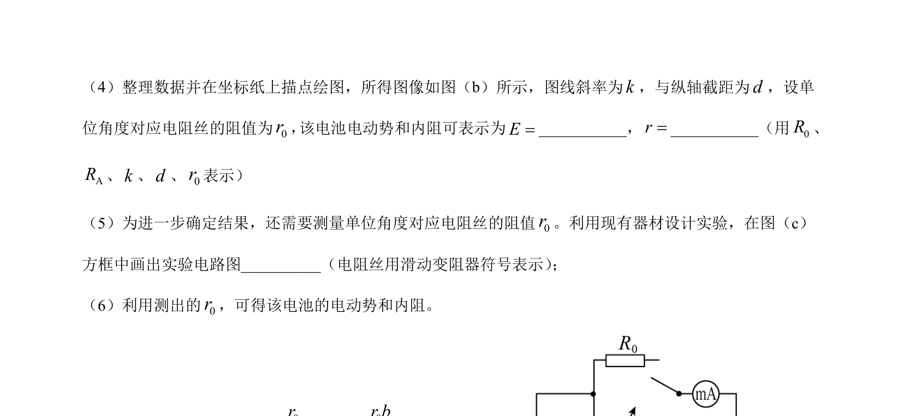
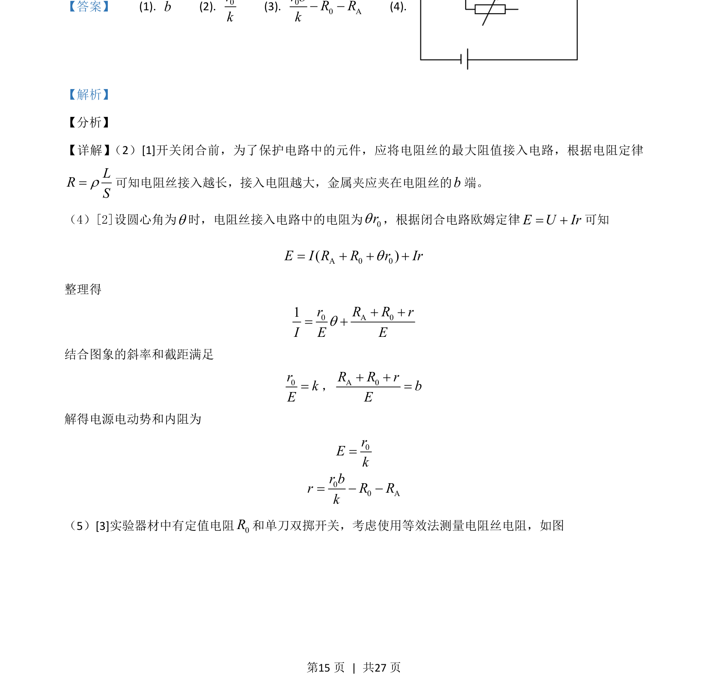
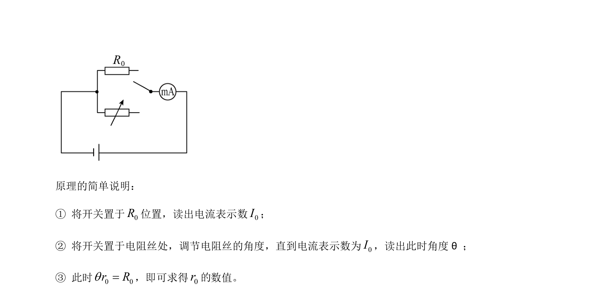

## 题面

## 摘要

该题考查利用电阻丝和闭合电路欧姆定律测量电源电动势、内阻，并设计等效法测电阻丝电阻。

## 关联考点

- [[332-闭合电路欧姆定律|闭合电路欧姆定律]]
- [[318-电阻定律|电阻定律]]
- [[861-图像法处理数据|图像法处理数据]]
- [[等效替代法测电阻]]

## 答案与解析

> 📄 原 PDF 第 14 页：`素材/真题/湖南/2008-2024·（湖南）物理高考真题/2021年高考物理试卷（湖南）（解析卷）.pdf`
